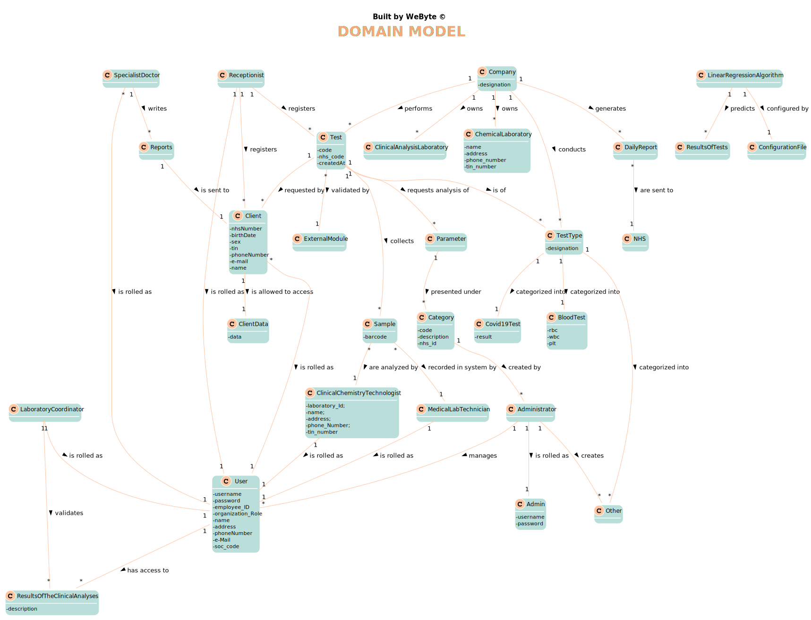

# OO Analysis #

The construction process of the domain model is based on the client specifications, especially the nouns (for _concepts_) and verbs (for _relations_) used. 

## Rationale to identify domain conceptual classes ##
To identify domain conceptual classes, start by making a list of candidate conceptual classes inspired by the list of categories suggested in the book "Applying UML and Patterns: An Introduction to Object-Oriented Analysis and Design and Iterative Development". 

### _Conceptual Class Category List_ ###

**Business Transactions**

*  Test
*  Covid19Test
*  BloodTest

---

**Transaction Line Items**

*  Sample

---

**Product/Service related to a Transaction or Transaction Line Item**

*  Parameter
*  LinearRegressionAlgorithm

---

**Transaction Records**

*  Reports
*  DailyReports

---  

**Roles of People or Organizations**

*   Client
*   Administrator
*   Receptionist
*   Medical lab technician
*   Clinical chemistry technologist
*   Laboratory coordinator
*   SpecialistDoctor
*   User

---

**Places**

*  Clinical Analysis Laboratory
*  Chemical Laboratory

---

**Noteworthy Events**

* ResultsOfTheClinicalAnalyses
* ResultsOfTests

---

**Physical Objects**

* Sample

---

**Descriptions of Things**

* TestType
* Category
* Parameter

---

**Organizations**

*  Company
*  NHS

---

**Other External/Collaborating Systems**

*  ExternalModule

---

**Records of finance, work, contracts, legal matters**

*  ClientData

---

**Documents mentioned/used to perform some work/**

*  Reports
*  DailyReports
*  ConfigurationFile

---

### **Rationale to identify associations between conceptual classes** ###

An association is a relationship between instances of objects that indicates a relevant connection and that is worth of remembering, or it is derivable from the List of Common Associations: 

+ **_A_** is physically or logically part of **_B_**
+ **_A_** is physically or logically contained in/on **_B_**
+ **_A_** is a description for **_B_**
+ **_A_** known/logged/recorded/reported/captured in **_B_**
+ **_A_** uses or manages or owns **_B_**
+ **_A_** is related with a transaction (item) of **_B_**
+ etc.

| Concept (A) 		|  Association   	|  Concept (B) |
|----------	   		|:-------------:		|------:       |
| Company  	| owns    		 	| ChemicalLaboratory  |
|   	| owns    		 	| ClinicalAnalysisLaboratory  |
|   	| performs    		 	| Test  |
|   	| conducts    		 	| TestType  |
|   	| generates    		 	| Reports  |
| Test  	| collects    		 	| Sample  |
|   	| requested by    		 	| Client  |
|   	| is of    		 	| TestType  |
|   	| requests analysis of          | Parameter  |
|   	| validated by    		 	| ExternalModule  |
| Parameter  	| presented under    		 	| Category  |
| Category  	| created by    		 	| Administrator  |
| Receptionist  	| registers    		 	| Client  |
|           	| is rolled as    		 	| User  |
| Samples  	| recorded in system by    		 	| MedicalLabTechnician  |
|   	| are analyzed by    		 	| ClinicalChemistryTechnologist  |
| ResultsOfTheClinicalAnalyses  	| validated by    		 	| LaboratoryCoordinator  |
| LinearRegressionAlgorithm  	| predicts    		 	| ResultsOfTests  |
|   	| configured by    		 	| ConfigurationFile  |
| SpecialistDoctor  	| is allowed to access    		 	| ClientData  |
|   	| writes    		 	| Reports  |
| Client  	| is allowed to access    		 	| ClientData  |
|   	| is rolled as    		 	| User  |
| MedicalLabTechnician  	| is rolled as    		 	| User  |
| LaboratoryCoordinator  	| is rolled as    		 	| User  |
|   	| validates    		 	| ResultsOfTheClinicalAnalyses  |
| ClinicalChemistryTechnologist  	| is rolled as    		 	| User  |
| TestType  	| categorized into    		 	| Covid19Test  |
|   	| categorized into    		 	| BloodTest  |
|   	| categorized into    		 	| Other  |
| Administrator  	| is rolled as    		 	| Admin  |
|   	| creates    		 	| Other  |
|   	| manages    		 	| User  |
| Reports  	| are sent to    		 	| NHS  |
| DailyReport  	| is sent to    		 	| Client  |
| User | has access to | ResultsOfTheClinicalAnalyses |

## Domain Model

**Do NOT forget to identify concepts atributes too.**

**Insert below the Domain Model Diagram in a SVG format**

