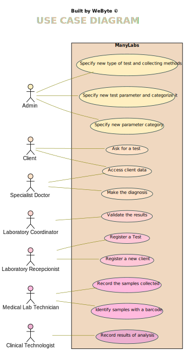

# Use Case Diagram (UCD)

**In the scope of this project, there is a direct relationship of _1 to 1_ between Use Cases (UC) and User Stories (US).**

However, be aware, this is a pedagogical simplification. On further projects and curricular units might also exist _1 to N **and/or** N to 1 relationships between US and UC.

**Insert below the Use Case Diagram in a SVG format**

**For each UC/US, it must be provided evidences of applying main activities of the software development process (requirements, analysis, design, tests and code). Gather those evidences on a separate file for each UC/US and set up a link as suggested below.**

# Use Cases / User Stories
| UC/US  | Description                                                               |                   
|:----|:------------------------------------------------------------------------|
| US1 |[Specify new type of test and collecting methods](US1.md) |
| US2 |[Specify new test parameter and categorize it](US2.md) |
| US3 |[Specify new parameter category](US3.md) |
| US4 |[Ask for a test](US4.md) |
| US5 |[Access client data](US5.md) |
| US6 |[Make the diagnosis](US6.md) |
| US7 |[Validate the results](US7.md) |
| US8 |[Register a Test](US8.md) |
| US9 |[Register a new client](US9.md) |
| US10 |[Record the samples collected](US10.md) |
| US11 |[Identify samples with a barcode](US11.md) |
| US12 |[Record results of analysis](US12.md) |