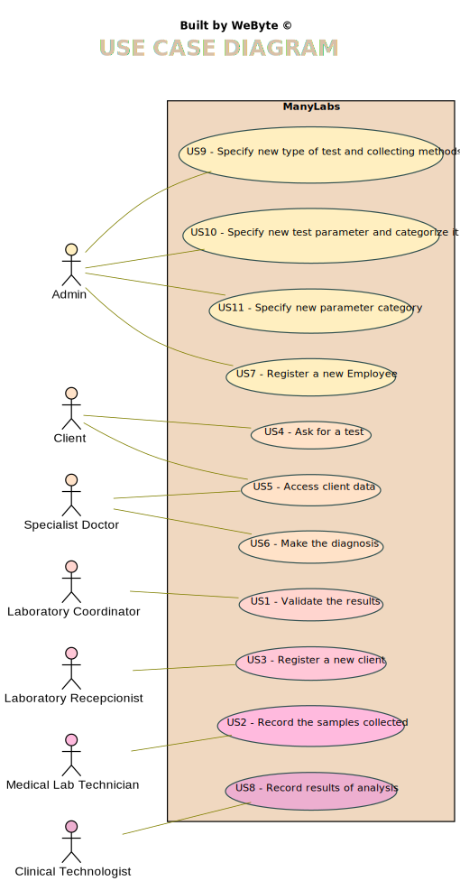

# Use Case Diagram (UCD)

**In the scope of this project, there is a direct relationship of _1 to 1_ between Use Cases (UC) and User Stories (US).**

However, be aware, this is a pedagogical simplification. On further projects and curricular units might also exist _1 to N **and/or** N to 1 relationships between US and UC.

**Insert below the Use Case Diagram in a SVG format**

**For each UC/US, it must be provided evidences of applying main activities of the software development process (requirements, analysis, design, tests and code). Gather those evidences on a separate file for each UC/US and set up a link as suggested below.**

# Use Cases / User Stories
| UC/US  | Description                                                               |                   
|:----|:------------------------------------------------------------------------|
| US1 |[Validate the results](User Stories/US1.md) |
| US2 |[Record the samples collected](User Stories/US2.md) |
| US3 |[Register a new client](User Stories/US3.md) |
| US4 |[Ask for a test](User Stories/US4.md) |
| US5 |[Access client data](User Stories/US5.md) |
| US6 |[Make the diagnosis](User Stories/US6.md) |
| US7 |[Register a new Employee](User Stories/US7.md) |
| US8 |[Record results of analysis](User Stories/US8.md) |
| US9 |[Specify new type of test and collecting methods](User Stories/US9.md) |
| US10 |[Specify new test parameter and categorize it](User Stories/US10.md) |
| US11 |[Specify new parameter category](User Stories/US11.md) |
