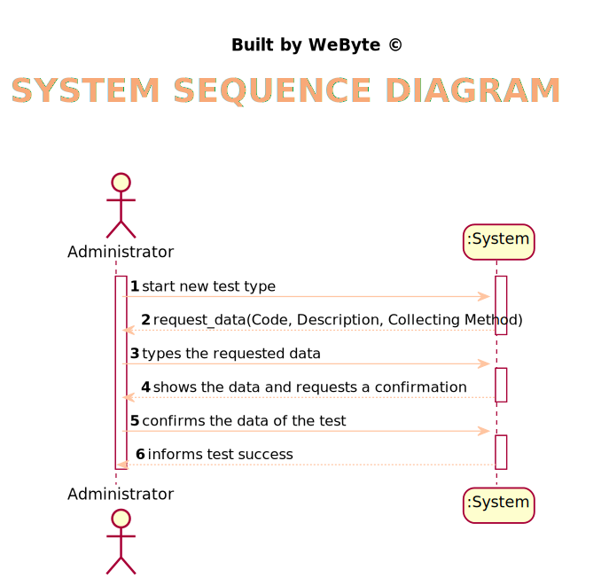
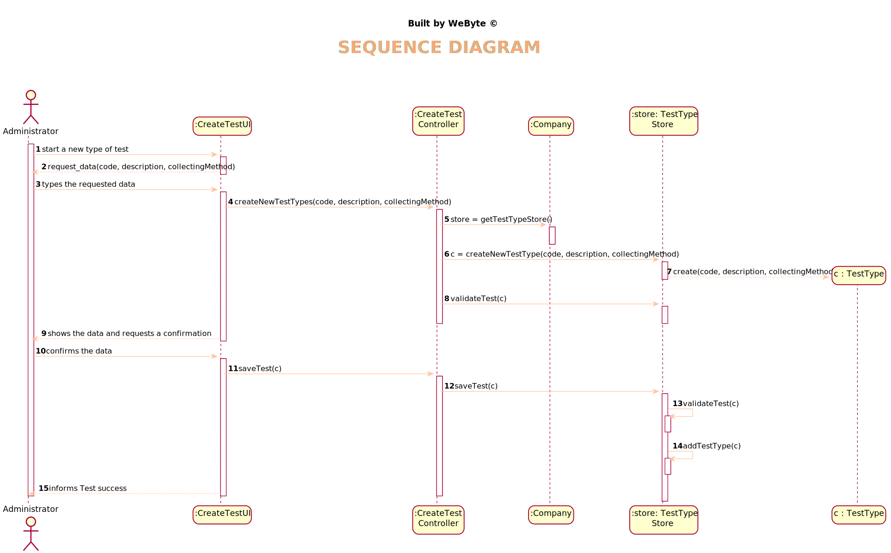
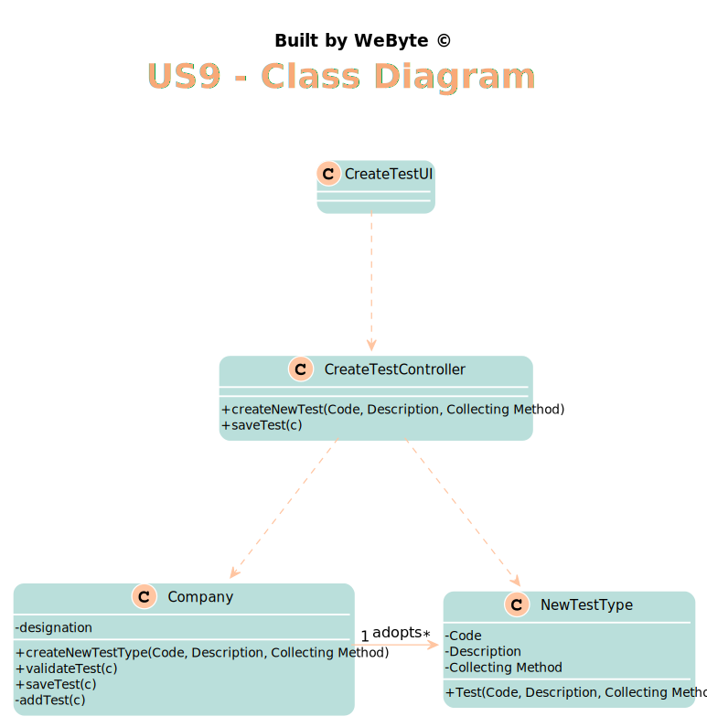

# US 9 - Specify a New Type of test

## 1. Requirements Engineering

### 1.1. User Story Description

*As an administrator, I want to specify a new type of test and its collecting methods*

### 1.2. Customer Specifications and Clarifications

>**Q:** Does a type of test holds any atributte besides it's name and collecting methods?

>**A:** The attributes for a new test type are:
Code: five alphanumeric characters. The code is not automatically generated.
Description: a string with no more than 15 characters.
Collecting Method: a string with no more than 20 characters.
Each test type should have a set of categories. Each category should be chosen from a list of categories.
From a previous post: "Each category has a name and a unique code. There are no subcategories.

>**Q:**  Are the collecting methods stored simpled as a word or a sentence, or does it also must contain it's description, and/or another attributes?

>**A:** From a previous post: "To make a Covid test you need a swab to collect a sample. To make a blood test you need sample tubes and a syringe.
When the administrator (US9) specifies a new type of test, the administrator also specifies the method to collect a sample. The administrator introduces a brief description for specifying the collecting method. "
### 1.3. Acceptance Criteria

*AC1- There exists only one collection method per test type.*

*AC2- Each category should be chosen from a list of categories.*

*AC3- The code is not automatically generated.*

*AC4- None of the attributes can be blank.*

### 1.4. Found out Dependencies

*No Dependencies were found*

### 1.5 Input and Output Data

*Input Data
* Typed data: Code, Description, Collecting Method
* Selected data: Categories
  Output Data
* (In)Success of the operation*

### 1.6. System Sequence Diagram (SSD)

*Insert here a SSD depicting the envisioned Actor-System interactions and throughout which data is inputted and outputted to fulfill the requirement. All interactions must be numbered.*

### 1.7 Other Relevant Remarks

*Use this section to capture other relevant information that is related with this US such as (i) special requirements ; (ii) data and/or technology variations; (iii) how often this US is held.*

## 2. OO Analysis

### 2.1. Relevant Domain Model Excerpt
*In this section, it is suggested to present an excerpt of the domain model that is seen as relevant to fulfill this requirement.*

### 2.2. Other Remarks

*Use this section to capture some additional notes/remarks that must be taken into consideration into the design activity. In some case, it might be usefull to add other analysis artifacts (e.g. activity or state diagrams).*

## 3. Design - User Story Realization

### 3.1. Rationale

**The rationale grounds on the SSD interactions and the identified input/output data.**

| Interaction ID | Question: Which class is responsible for... | Answer  | Justification (with patterns)  |
|:-------------  |:--------------------- |:------------|:---------------------------- |
|Step 1 		 |	... interacting with the actor? | CreateTestUI   |  Pure Fabrication: there is no reason to assign this responsibility to any existing class in the Domain Model.
|                |  ... coordinating the US? |       CreateTestController      |   Controller                           |
| Step 2  		 |							 |             |                              |
| Step 3  		 |  ... save the new type of test|    TestTypeStore         |      IE: object created has its own data                        |
|                |  ... instantiating a new test type? |       TestTypeStore      |   Creator    |
| Step 4  		 |							 |             |                              |              
| Step 5  		 |	... validating all data (local validation)?	         |   TestType   |    IE: owns its data.                          |              
|  		         |	... validating all data (global validation)?         |   TestTypeStore  |  IE: knows all labs                             |              
|  		         |	... saving the created task?						 |   TestTypeStore          |   IE: stores all labs                           |              
| Step 6  		 |		... informing operation success?					 |    CreateTestUI        |   IE: is responsible for user interaction                           |
### Systematization ##

According to the taken rationale, the conceptual classes promoted to software classes are:

* TestType
 

Other software classes (i.e. Pure Fabrication) identified:
* CreateTestUI
* CreateTestController
* TestTypeStore

## 3.2. Sequence Diagram (SD)

*In this section, it is suggested to present an UML dynamic view stating the sequence of domain related software objects' interactions that allows to fulfill the requirement.*

## 3.3. Class Diagram (CD)

*In this section, it is suggested to present an UML static view representing the main domain related software classes that are involved in fulfilling the requirement as well as and their relations, attributes and methods.*

# 4. Tests
*In this section, it is suggested to systematize how the tests were designed to allow a correct measurement of requirements fulfilling.*

**_DO NOT COPY ALL DEVELOPED TESTS HERE_**

**Test 1:** Checks that the code has the correct format (5 digits)

    @Test
    public void checkSizesCodeCorrect() {
        test.checkCode("11111");
    }

**Test 2:** Checks that a Test Type cannot be created with empty collecting method.

    @Test
    public void checkMethodEmpty() {
        exceptionRule.expect(IllegalArgumentException.class);
        exceptionRule.expectMessage("Collecting method cannot be empty.");
        test.checkCollectingMethod("");
    }

**Test 3:** Checks that the string with all the data of the test type has the correct format and data

    @Test
    public void checkToString() {
        String expected = "TestType{code='12346', description='Urine', collectingMethod='Collected in ManyLabs', Category/categories selected: Hemograma}";
        Assert.assertEquals(true, expected.equals(test.toString()));
    }

**Test 4:** Checks that a new test type is created correctly

    @Test
    public void createNewTestType() {
        TestType test = new TestType("12345","Urine","InManyLabs",categoryList);
        TestTypeStore TestTypeStore = new TestTypeStore();
        TestType t1= TestTypeStore.createTestType("12345","Urine","InManyLabs",categoryList);
        Assert.assertEquals(true, t1.equals(test));
    }

*It is also recommended to organize this content by subsections.*

# 5. Construction (Implementation)

*In this section, it is suggested to provide, if necessary, some evidence that the construction/implementation is in accordance with the previously carried out design. Furthermore, it is recommeded to mention/describe the existence of other relevant (e.g. configuration) files and highlight relevant commits.*

*It is also recommended to organize this content by subsections.*

##CreateTestController
    public class CreateTestController {
      private Company company;
      private TestType c;
      private TestTypeStore store;
  
      public CreateTestController(){
          this(App.getInstance().getCompany());
      }
  
      public CreateTestController(Company company){
          this.company = company;
  
      }
  
      public void createNewTestType(String code, String description, String collectionMethod, List<ParameterCategory> parameterCategories){
          store = company.getTestTypeStore();
          c = store.createTestType(code, description, collectionMethod, parameterCategories);
          store.validateTest(c);
  
      }

##TestTypeStore

    public class TestTypeStore {
      private List<TestType> TestTypeList = new ArrayList<>();
  
      public TestTypeStore() {
      }
  
      public TestType createTestType(String code, String description, String collectingMethod, List<ParameterCategory> parameterCategoryList) {
          return new TestType(code, description, collectingMethod, parameterCategoryList);
  
      }
  
      public void validateTest(TestType testType) {
          if(TestTypeList.contains(testType)){
              throw new IllegalArgumentException("invalid arguments for test creation.");
          }
  
      }
  
      public void saveTest(TestType testType) {
          validateTest(testType);
  
          addTestType(testType);
      }
  
      public void addTestType(TestType testType) {
  
          this.TestTypeList.add(testType);
      }

# 6. Integration and Demo

*In this section, it is suggested to describe the efforts made to integrate this functionality with the other features of the system.*

This user story had to be integrated with 10 and 11, as it uses a category of parameters, something that was not easy, but we managed!

# 7. Observations

*In this section, it is suggested to present a critical perspective on the developed work, pointing, for example, to other alternatives and or future related work.*