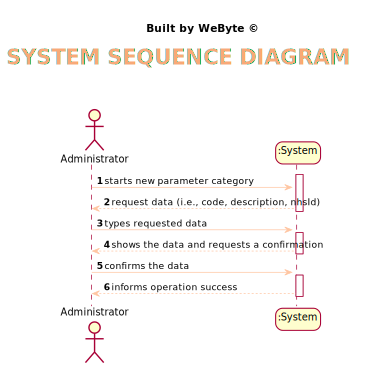
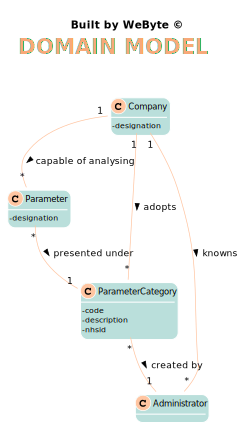
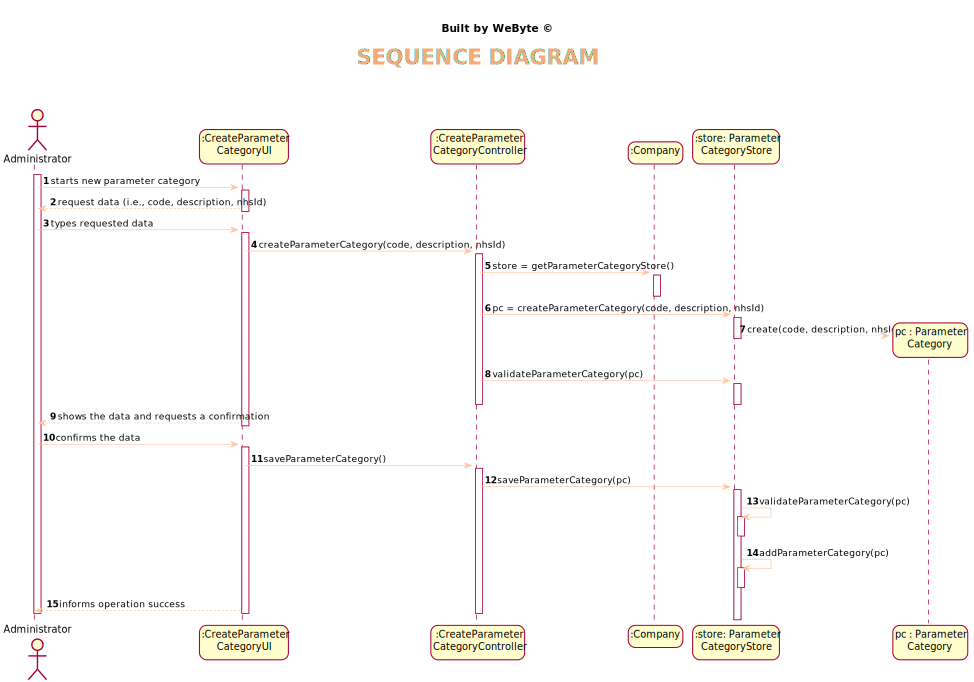
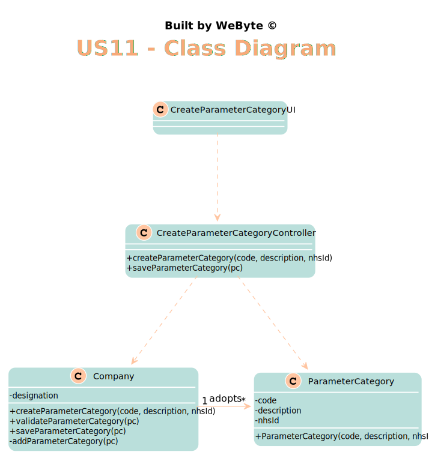

# US 11 - Specify a new parameter category.

## 1. Requirements Engineering

### 1.1. User Story Description

*As an administrator, I want to specify a new parameter category.*

### 1.2. Customer Specifications and Clarifications

From the Specifications Document:
* >“Blood tests are frequently characterized by measuring several parameters which for presentation/reporting purposes are organized
  by categories. For example, parameters such as the number of Red Blood Cells (RBC), White Blood Cells (RBC) and Platelets (PLT) are
  usually presented under the blood count (Hemogram) category.”
* >“Regardless, such tests rely on measuring one or more parameters that can be grouped/organized by categories.” 
* From the client clarifications:
* > Question: What are the data that characterize a parameter category?
* > Answer: Simply consider a code, a description and an NHS identifier

### 1.3. Acceptance Criteria

* AC1: Code must be unique having 4 to 8 chars
* AC2: Description cannot be empty and has, at maximum, 40 chars
* AC3: NHS identifier is not mandatory

### 1.4. Found out Dependencies

*No dependencies were found*

### 1.5 Input and Output Data

Input Data
* Typed data: code, description and NHS identified
* Selected data: (none)
  Output Data
* (In)Success of the operation

### 1.6. System Sequence Diagram (SSD)

*Insert here a SSD depicting the envisioned Actor-System interactions and throughout which data is inputted and outputted to fulfill the requirement. All interactions must be numbered.*

### 1.7 Other Relevant Remarks

*Use this section to capture other relevant information that is related with this US such as (i) special requirements ; (ii) data and/or technology variations; (iii) how often this US is held.*

## 2. OO Analysis

### 2.1. Relevant Domain Model Excerpt
*In this section, it is suggested to present an excerpt of the domain model that is seen as relevant to fulfill this requirement.*

### 2.2. Other Remarks

*Use this section to capture some aditional notes/remarks that must be taken into consideration into the design activity. In some case, it might be usefull to add other analysis artifacts (e.g. activity or state diagrams).*

## 3. Design - User Story Realization

### 3.1. Rationale

**The rationale grounds on the SSD interactions and the identified input/output data.**

| Interaction ID | Question: Which class is responsible for... | Answer  | Justification (with patterns)  |
|:-------------  |:--------------------- |:------------|:---------------------------- |
| Step/Msg 1: starts new parameter category	| ... instantiating a new Parameter Category?	| ParameterCategoryStore    |                              |
| Step/Msg 2: request data (i.e., code, description, nhsId)  |	n/a						 |             |                              |
| Step/Msg 3: types requested data  |	...saving the input data?	| Parameter Category  |  IE: The object created in step 1 has its own data. |
| Step/Msg 4: shows the data and requests a confirmation  	|	… validating the data locally (e.g.: mandatory vs. non-mandatory data)?	 |  Parameter Category | IE: know                      
|                           | … validating the data globally (e.g.: duplicated)? | ParameterCategoryStore | IE: knows all the ParameterCategory objects
| Step/Msg 5: confirms the data | .. saving the created parameter category?	| ParameterCategoryStore  | IE: adopts/records all the ParameterCategory objects                             |
| Step/Msg 6: informs operation success  |	... informing operation success? | UI |  IE: responsible for user interaction |              

### Systematization ##

According to the taken rationale, the conceptual classes promoted to software classes are:

* Company
* ParameterCategory

Other software classes (i.e. Pure Fabrication) identified:
* CreateCategoryUI
* CreateCategoryController
*  ParameterCategoryStore

## 3.2. Sequence Diagram (SD)

*In this section, it is suggested to present an UML dynamic view stating the sequence of domain related software objects' interactions that allows to fulfill the requirement.*

## 3.3. Class Diagram (CD)

*In this section, it is suggested to present an UML static view representing the main domain related software classes that are involved in fulfilling the requirement as well as and their relations, attributes and methods.*

# 4. Tests
*In this section, it is suggested to systematize how the tests were designed to allow a correct measurement of requirements fulfilling.*

**_DO NOT COPY ALL DEVELOPED TESTS HERE_**

**Test 1:** Checks that one parameter category is not equal to another.

    @Test
    public void testEqualsFalse() {
        ParameterCategory pc1 = new ParameterCategory("12346", "Category");
        ParameterCategory pc2 = new ParameterCategory("12332", "Hemograma");
        Assert.assertEquals(false, pc1.equals(pc2));
    }

**Test 2:** Checks that a parameter category cannot have a name longer than 10 characters.

    @Test
    public void checkNameBig() {
        exceptionRule.expect(IllegalArgumentException.class);
        exceptionRule.expectMessage("Name cannot be longer than 10 characters");
        pc.checkNameRules("123111111111111111");
    }

**Test 3:** Checks that a new parameter category is added to the list containing all parameter categories.

    @Test
    public void add() {
      store.add(pc);
      store.getParameterCategoryList().contains(pc);
    }

**Test 4:** Checks that the parameter category that has the same description as the one passed by parameter is returned.

    @Test
    public void getParameterCategoryByDescription() {
        store.add(pc);
        store.getParameterCategoryByDescription(pc.getName());
        System.out.println(store.getParameterCategoryByDescription(pc.getName()));
        Assert.assertEquals(true, store.getParameterCategoryByDescription(pc.getName()).equals(pc));
    }

*It is also recommended to organize this content by subsections.*

# 5. Construction (Implementation)

*In this section, it is suggested to provide, if necessary, some evidence that the construction/implementation is in accordance with the previously carried out design. Furthermore, it is recommeded to mention/describe the existence of other relevant (e.g. configuration) files and highlight relevant commits.*

*It is also recommended to organize this content by subsections.*

##CreateParameterCategoryController

    public class CreateParameterCategoryController {
      private Company company;
      private ParameterCategory pc;
      private ParameterCategoryStore store;
  
      public CreateParameterCategoryController() {
          this(App.getInstance().getCompany());
  
      }
  
      public CreateParameterCategoryController(Company company) {
          this.company = company;
          this.pc = null;
      }
  
      public boolean createParameterCategory(String code, String description){
          store = company.getParameterCategoryStore();
          pc = store.createParametercategory(code, description);
          return store.validateParameterCategory(pc);
      }

##ParameterCategoryStore

    public class ParameterCategoryStore {
      private List<ParameterCategory> parameterCategoryList;
  
  
      public ParameterCategoryStore(){
          parameterCategoryList = new ArrayList<>();
          parameterCategoryList.add(new ParameterCategory("he001", "Hemogram"));
      }
  
      public ParameterCategory createParametercategory(String code, String description){
          return new ParameterCategory(code, description);
      }
  
      public boolean validateParameterCategory(ParameterCategory pc) {
          if (pc == null)
              throw new IllegalArgumentException("Parameter Category cannot be null");
          else if (this.parameterCategoryList.contains(pc)){
              throw new IllegalArgumentException("Parameter Category already exists");
          }
          return !this.parameterCategoryList.contains(pc);
      }
  
      public boolean saveParameterCategory(ParameterCategory pc) {
          if (!validateParameterCategory(pc))
              return false;
          return this.parameterCategoryList.add(pc);
      }
  
      public ParameterCategory getParameterCategoryByDescription(String description){
          for (ParameterCategory pc : getParameterCategoryList()){
              if (pc.getName().equals(description)){
                  return pc;
              }
          }
          return null;
      }

# 6. Integration and Demo

*In this section, it is suggested to describe the efforts made to integrate this functionality with the other features of the system.*

This user story is related to the user story of creating a new parameter, since to create a new parameter it is necessary to choose a category and associate it to the parameter.  Besides, in the creation of a new type of test, it is also necessary to associate to a new type of test one or several categories of parameters, so it is also related to US9.

# 7. Observations

*In this section, it is suggested to present a critical perspective on the developed work, pointing, for example, to other alternatives and or future related work.*

