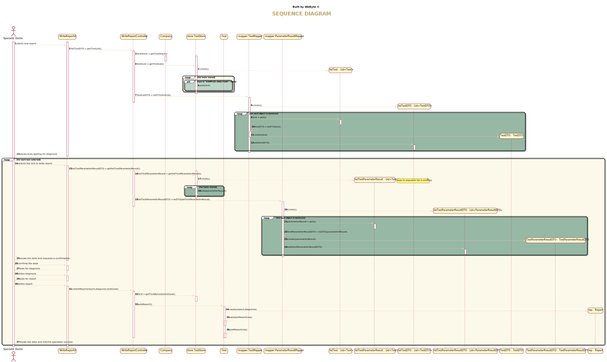

# US 14 - Diagnosis and report for a test.

## 1. Requirements Engineering

### 1.1. User Story Description

*As a specialist doctor, I intend to make the diagnosis and write a report for a
given test.*

### 1.2. Customer Specifications and Clarifications

From the Specifications Document:
* >“After completing the chemical analysis, the results of all chemical analyses are analysed by a
  specialist doctor who makes a diagnosis and writes a report that afterwards will be delivered to the
  client”
* From the client clarifications:
* > Q: Can you say the difference between the diagnosis and the report , what witch one should have and their roles in the project ?

* > A: The report contains the diagnosis. The report is free text.

* > Q: What kind of validation should the external module do? Should it show the test reference values next to the test parameter results for the Specialist Doctor to validate it by himself? Or should it show on the console that the values of the test parameter results are valid, doing everything automatically?  

* > A: The system should "show the test reference values next to the test parameter results".

* > Q: Once the specialist doctor decides to write the report for a given test, should the results of the chemical analysis and the reference values be presented on the screen? If not, how should the specialist doctor access the data related to the diagnosis he needs to make?  

* > A: After selecting a test (to make the diagnosis/report) the results of the chemical analysis and the reference values should be presented on the screen. Then the Specialist Doctor should write the report.

* > Q: While in the "Make a diagnosis and write a report" option of the main menu, should the specialist doctor be able to make a diagnosis and write a report for more than one test? Or does he need to exit and enter the "Make a diagnosis and write a report" option every time he wants to make a new diagnosis and write a new report?

* > A: After writing a report the SD can choose to write other reports without leaving the use case.

* > Q: What characterizes a diagnosis? What it needs to have in it to be a valid diagnosis?

* > A:The report contains the diagnosis. The report is free text and should have no more than 400 words.

* > Q:Regarding the tests that the Specialist Doctor can write a report about. Should the SD chose from a list of tests? and Should him only receive a list of test that have completed all the previous steps?

* > A:The system shows all tests ready (that have completed all the previous steps) to make the diagnosys and the Specialist Doctor selects one test. Then, the Specialist Doctor writes the report for the selected test.

### 1.3. Acceptance Criteria

* AC1: The report contains the diagnosis.
* AC2: Report contains at most 400 words.
* AC3: The system shows test results and test reference values.
* AC4: To make the diagnosis and the report, the test must be in "Samples Analysed" status.

### 1.4. Found out Dependencies

* *There is a dependency to "US4- As a receptionist of the laboratory, I intend to register a test to be performed to a registered client." since there needs to be a test to be performed a report*
* *There is a dependency to "US12- As a clinical chemistry technologist, I intend to record the results of a given test." since the result of the test is needed to make the diagnosis.*

### 1.5 Input and Output Data

Input Data:

* Typed data:  diagnosis; report
  
* Selected data: tests
  
* Output Data: Success or failure of the operation

### 1.6. System Sequence Diagram (SSD)

*Insert here a SSD depicting the envisioned Actor-System interactions and throughout which data is inputted and outputted to fulfill the requirement. All interactions must be numbered.*

### 1.7 Other Relevant Remarks

*Use this section to capture other relevant information that is related with this US such as (i) special requirements ; (ii) data and/or technology variations; (iii) how often this US is held.*

## 2. OO Analysis

### 2.1. Relevant Domain Model Excerpt
*In this section, it is suggested to present an excerpt of the domain model that is seen as relevant to fulfill this requirement.*

### 2.2. Other Remarks

*Use this section to capture some aditional notes/remarks that must be taken into consideration into the design activity. In some case, it might be usefull to add other analysis artifacts (e.g. activity or state diagrams).*

## 3. Design - User Story Realization

### 3.1. Rationale

**The rationale grounds on the SSD interactions and the identified input/output data.**

| Interaction ID | Question: Which class is responsible for... | Answer  | Justification (with patterns)  |
|:-------------  |:--------------------- |:------------|:---------------------------- |
|Step 1 		 |	...interacting with the actor? | WriteReportUI   |  Pure Fabrication: there is no reason to assign this responsibility to any existing class in the Domain Model.
|                |  ...coordinating the US? |       WriteReportController      |   Controller   
|	|...knowing the test to show?	| TestStore  |  IE: TestStore contains the tests and its state |
| Step 2  |						 |             |                              |
| Step 3  |	...allowing the selection of the test	| WriteReportUI  | Pure Fabrication: there is no reason to assign this responsibility to any existing class in the Domain Model. |
|	|...knowing the parameters results to show?	| TestStore  |  IE: TestStore contains the tests and results |
| Step 4  	|
| Step 5| ...confirming the data?                         |WriteReportUI | Pure Fabrication: there is no reason to assign this responsibility to any existing class in the Domain Model.
| Step 6 |
| Step 7  |	...allowing the imput of the diagnosis?					 |   WriteReportUI         |  Pure Fabrication: there is no reason to assign this responsibility to any existing class in the Domain Model.                            |
| Step 8 |
| Step 9 |...allowing the imput of the report?					 |   WriteReportUI         |  Pure Fabrication: there is no reason to assign this responsibility to any existing class in the Domain Model.
|                |  ... Saving the report data? |       Test      |   IE: object created has its own data     |
|                |  ...instantiating a new Report? |       Test      |   Creator    |
|                |...validating all data (local validation)?	         |   Report   |    IE: owns its data.
|                |...validating all data (global validation)?	         |   Test   |    IE: knows the report
| Step 10  		 |		... informing operation success?					 |     WriteReportUI        |   IE: is responsible for user interaction                           |

### Systematization ##

According to the taken rationale, the conceptual classes promoted to software classes are:

* Test

* Report

Other software classes (i.e. Pure Fabrication) identified:

* WriteReportUI

* WriteReportController

* TestStore

## 3.2. Sequence Diagram (SD)

*In this section, it is suggested to present an UML dynamic view stating the sequence of domain related software objects' interactions that allows to fulfill the requirement.*

## 3.3. Class Diagram (CD)

*In this section, it is suggested to present an UML static view representing the main domain related software classes that are involved in fulfilling the requirement as well as and their relations, attributes and methods.*

# 4. Tests
*In this section, it is suggested to systematize how the tests were designed to allow a correct measurement of requirements fulfilling.*

**Test 1:** Checks if a report is added to a test.

     @Test
    public void addReport() throws OutputException, BarcodeException, IOException, ClassNotFoundException, InstantiationException, IllegalAccessException {
        test.addSample(1);
        test.addTestResult("HB000", "cheiro fétido", "g/m3");
        test.validateParameterResult();
        Report report = new Report("result", "report");
        test.addReport(report);
        Assert.assertEquals(test.getReport(),report);

    }

**Test 2:** Checks if a test is not on the correct state and throws an exception.

     @Test
    public void addReportException() throws OutputException, BarcodeException, IOException, ClassNotFoundException, InstantiationException, IllegalAccessException {
        exceptionRule.expect(IllegalAccessError.class);
        exceptionRule.expectMessage("You cannot add a report to a test that isn't in samples analysed state.");

        test.addReport(new Report("result", "report"));
        Assert.assertTrue(test.getReport().equals(new Report("result", "report")));

    }

**Test 3:** Checks ifs a test with a report over 400 words and throws an exception.

    @Test
    public void validateReportTooBig() {
        exceptionRule.expect(IllegalArgumentException.class);
        exceptionRule.expectMessage("This report is invalid, you entered too many words (Max 400 words)");
        test.validateReport(new Report("r a r a r a r a r a r a r a r a r a r a r a r a r a r a r a r a r a r a r a r a r a r a r a r a r a r a r a r a r a r a r a r a r a r a r a r a r a r a r a r a r a r a r a r a r a r a r a r a r a r a r a r a r a r a r a r a r a r a r a r a r a r a r a r a r a r a r a r a r a r a r a r a r a r a r a r a r a r a r a r a r a r a r a r a r a r a r a r a r a r a r a r a r a r a r a r a r a r a r a r a r a r a r a r a r a r a r a r a r a r a r a r a r a r a r a r a r a r a r a r a r a r a r a r a r a r a r a r a r a r a r a r a r a r a r a r a r a r a r a r a r a r a r a r a r a r a r a r a r a r a r a r a r a r a r a r a r a r a r a r a r a r a r a r a r a r a r a r a r a r a r a r a r a r a r a r a r a r a r a r a r a r a r a r a r a r a r a r a r a r a r a r a r a r a r a r a r a r a r a r a  ", "report"));
    }

# 5. Construction (Implementation)

*In this section, it is suggested to provide, if necessary, some evidence that the construction/implementation is in accordance with the previously carried out design. Furthermore, it is recommeded to mention/describe the existence of other relevant (e.g. configuration) files and highlight relevant commits.*

*It is also recommended to organize this content by subsections.*

## WriteReportController

    public class WriteReportController {
    private Company company;
    private TestStore store;
    private ParameterResultMapper parameterResultMapper = new ParameterResultMapper();
    private TestMapper testMapper = new TestMapper();

    /**
     * Constructor
     */
    public WriteReportController(){
        this(App.getInstance().getCompany());
    }

    /**
     * Constructor defining company and store
     * @param company
     */
    public WriteReportController(Company company){
        this.company = company;
        store = company.getTestStore();
    }

    /**
     * This method returns the tests that are Available to write report
     * @return list of tests
     */
    public List<TestDTO> getTestListDTO() {
        List<TestDTO> testDTOList = new ArrayList<>();
        List<Test> listTest = store.getTestList();
        TestMapper mapper = new TestMapper();
        for (Test t : listTest) {
            if (t.isSamplesAnalysed()) {
                testDTOList.add(mapper.toDTO(t));
            }
        }
        return testDTOList;
    }

    /**
     * This method returns a test parameter result from a testDTO and a given ParameterDTO
     * @return TestParameterResult
     */
    public TestParameterResultDTO getTestParameterResult(TestDTO testDTO, ParameterDTO parameterDTO){
        return parameterResultMapper.toDTO(testDTO.getTestParameterFor(parameterDTO.getCode()).getTestParameterResul());
    }

    /**
     * this method creates a report
     * @param report
     * @param diagnosis
     * @param testDTO
     */
    public void createReport(String report, String diagnosis, TestDTO testDTO){
        Report fullReport = new Report(report, diagnosis);
        Test test = testMapper.toTest(testDTO);
        test.validateReport(fullReport);
        test.addReport(fullReport);
    }
}

## Test(only 2 methods are relevant)

    public void validateReport(Report report){
        if (report.getReport().split(" ").length + report.getdiagnosis().split(" ").length > 400){
            throw new IllegalArgumentException("This report is invalid, you entered too many words (Max 400 words)");
        }
    }
    public void addReport(Report report){
            if(!isSamplesAnalysed()){
                throw new IllegalAccessError("You cannot add a report to a test that isn't in samples analysed state.");
            }
            else {
                this.report = report;
                status = "DIAGNOSIS MADE";
                reportMadeDate = getDate();
            }
        }

# 6. Integration and Demo

This user story is related to several User Stories, and the test state was really importanto to connect between all user stories..

# 7. Observations

