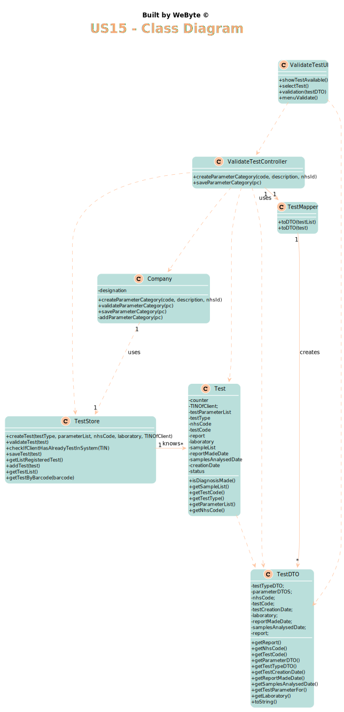

# US 15 - Validate the work done by the clinical chemistry technologist and specialist doctor.

## 1. Requirements Engineering

### 1.1. User Story Description

*As a laboratory coordinator, I want to validate the work done by the clinical chemistry technologist and specialist doctor.*

### 1.2. Customer Specifications and Clarifications

From the Specifications Document:
* “After the specialist doctor has completed the diagnosis, the results of the clinical analyses and the
  report become available in the system and must be validated by the laboratory coordinator. To
  validate the work done, the laboratory coordinator checks the chemical test/result and associated
  diagnosis made and confirms that everything was done correctly.”

From the client clarifications:

* > -- <cite> Question: Regarding the process of validating a certain test/result, what validation states should be considered by the laboratory coordinator?
  For example, can "Valid" or "Invalid" be accepted as a confirmation for the chemical test/result and its diagnosis?

* > -- <cite> Answer: Only Valid state. The system shows all tests ready to validate (tests that already have the test registration date, the chemical analysys date and the diagnosis date registered in the system) and the laboratory coordinator selects one or more tests to mark as validated.

* > -- <cite> Question: To validate a test the laboratory coordinator should validate all the test results and the test report in that specific order?

* > -- <cite> Answer: Please read carefully my answers! The laboratory coordinator only sees dates of each test.

* > -- <cite> Question: As soon as a test is validated should the system send the notification to a txt file like in sprint B?

* > -- <cite> Answer: Please read carefully my answers!
  In the Project Description we get: "Once the laboratory coordinator
  confirms that everything was done correctly, the client receives a notification alerting that the
  results are already available in the central application and informing that he/she must access the
  application to view those results. The client receives the notification by SMS and e-mail. "
  In a previous post in this forum:
  "During the development of the Integrative Project we will not use any e-mail or SMS API services to send messages. All the e-mail and SMS messages should be written to a file with the name emailAndSMSMessages.txt. This file simulates the use of e-mail and SMS API services. "

* > -- <cite> Question: How should the laboratory coordinator choose the test to operate on, from a list of all the tests with a result and report or by inputting the code unique to a specific test?

* > -- <cite> Answer: From a list of all tests that have a test registration date, a chemical analysis date, and a diagnosis date.

* > -- <cite> Question: Does the laboratory coordinator choose which client's results to validate?

* > -- <cite> Answer: The laboratory coordinator chooses a set of tests he wants to validate.****

* > -- <cite> Question: Does the notification sent to client informing them that they have their results on the central application get sent automatically after the laboratory coordinator confirms the clinical chemistry technologist and specialist doctor's work?

* > -- <cite> Answer: From the Project Description: "Once the laboratory coordinator confirms that everything was done correctly, the client receives a notification alerting that the results are already available in the central application and informing that he/she must access the application to view those results."

* > -- <cite> Question: Should the laboratory coordinator validate the test results one by one or should he do only one validation of all of them?

* > -- <cite> Answer: The coordinator can validate all or a subset of test results. The system does not show client personal information but shows all dates (test registration date, chemical analysys date and diagnosis date).

* > -- <cite> Question: When the laboratory coordinator wants to validate a test does all the tests available show up for him or does he search using a code that identifies a specific test?

* > -- <cite> Answer: The system shows all tests ready to validate (tests that already have the test registration date, the chemical analysys date and the diagnosis date registered in the system) and the laboratory coordinator selects one or more tests to mark as validated.

* > -- <cite> Question: What should happen to a test if either the test report or the results are invalid? Should we prompt for a redo of either process or simply erase the test?

* > -- <cite> Answer: The laboratory coordinator only sees the test dates of tests that already have all dates registered in the system (test registration date, the chemical analysys date and the diagnosis date).
  The objective of this user story is only for the laboratory coordinator to be aware of the work developed in the chemical laboratory and to mark the job as done.

* > -- <cite> Question: What's the Criteria to the validation of the test? We only receive dates but what do we have to do to check if everything is "ok" to validate?

* > -- <cite> Answer: The lab coordinator only checks the dates (date and time) and validates a subset of tests that he selects. The lab coordinador does not check any other information.
  From a previous post: "The system shows all tests ready to validate (tests that already have the test registration date, the chemical analysis date and the diagnosis date registered in the system) and the laboratory coordinator selects one or more tests to mark as validated".

* > -- <cite> Question: After we validate, we send the email saying they can check the app for the results. But what happens to the test ifself? Does it stay within the system or is deleted?

* > -- <cite> Answer: The tests should not be eliminated.

* > -- <cite> Question: After validation do we need to have the time and date of the validation?

* > -- <cite> Answer: Yes, the system should record the date (DD/MM/YYYY) and time (HH:MM) when the validation was made.
  Moreover, in this US, when the system shows to the laboratory coordinator all the dates (test registration date, chemical analysis date and diagnosis date), the system should show the date (DD/MM/YYYY) and the time (HH:MM).

### 1.3. Acceptance Criteria

* AC1: The system does not show client personal information but shows all dates (test registration date, chemical analysis date and diagnosis date).

### 1.4. Found out Dependencies

*There is a dependency to "US7- As an administrator, I want to register a new employee." since the laboratory coordinator needs to be registered to perform actions in his menu ui*

*There is a dependency to "US12- As a clinical chemistry technologist, I intend to record the results of a given test." since the result of the test is needed to make the diagnosis.*

*There is a dependency to "US14- As a specialist doctor, I intend to make the diagnosis and write a report for a
given test." since the report is needed to be validated by the laboratory coordinator.*

### 1.5 Input and Output Data

Input Data

* Typed data: (none)
  
* Selected data: test (ready for validation)
  
* Output Data: (In)Success of the operation

### 1.6. System Sequence Diagram (SSD)

*Insert here a SSD depicting the envisioned Actor-System interactions and throughout which data is inputted and outputted to fulfill the requirement. All interactions must be numbered.*

### 1.7 Other Relevant Remarks

*Use this section to capture other relevant information that is related with this US such as (i) special requirements ; (ii) data and/or technology variations; (iii) how often this US is held.*

## 2. OO Analysis

### 2.1. Relevant Domain Model Excerpt
*In this section, it is suggested to present an excerpt of the domain model that is seen as relevant to fulfill this requirement.*

### 2.2. Other Remarks

*Use this section to capture some aditional notes/remarks that must be taken into consideration into the design activity. In some case, it might be usefull to add other analysis artifacts (e.g. activity or state diagrams).*

## 3. Design - User Story Realization

### 3.1. Rationale

**The rationale grounds on the SSD interactions and the identified input/output data.**

| Interaction ID | Question: Which class is responsible for... | Answer  | Justification (with patterns)  |
|:-------------  |:--------------------- |:------------|:---------------------------- |
| Step 1         | ...interacting with the actor?              | ValidateTestUI         | Pure Fabrication: there is no reason to assign this responsibility to any existing class in the Domain Model. |
|                | ...coordinating the US?                     | ValidateTestController | Controller                                                                                                    |
|                | ...knowing the test to show?                | TestStore              | IE: TestStore contains the tests and its state                                                                |
| Step 2         |                                             |                        |                                                                                                               |
| Step 3         | ...allowing the selection of the test       | ValidateTestUI         | Pure Fabrication: there is no reason to assign this responsibility to any existing class in the Domain Model. |
| Step 4         |                                             |                        |                                                                                                               |
| Step 5         | ...confirming the data?                     | ValidateTestUI         | Pure Fabrication: there is no reason to assign this responsibility to any existing class in the Domain Model. |
| Step 6         |                                             |                        |                                                                                                               |
| Step 7         | ...allowing the validation of the test       | ValidateTestUI         | Pure Fabrication: there is no reason to assign this responsibility to any existing class in the Domain Model. |
| Step 8         | ...informing operation success?            | ValidateTestUI         | IE: is responsible for user interaction                                                                       |

### Systematization ##

According to the taken rationale, the conceptual classes promoted to software classes are:

* Company

* ParameterCategory

Other software classes (i.e. Pure Fabrication) identified:

* CreateCategoryUI

* CreateCategoryController

* ParameterCategoryStore

## 3.2. Sequence Diagram (SD)

*In this section, it is suggested to present an UML dynamic view stating the sequence of domain related software objects' interactions that allows to fulfill the requirement.*

## 3.3. Class Diagram (CD)

*In this section, it is suggested to present an UML static view representing the main domain related software classes that are involved in fulfilling the requirement as well as and their relations, attributes and methods.*

# 4. Tests
*In this section, it is suggested to systematize how the tests were designed to allow a correct measurement of requirements fulfilling.*

**_DO NOT COPY ALL DEVELOPED TESTS HERE_**

**Test 1:** Checks that a test is already validated

    @Test
    public void isValidated() {
        test.validateTest();
        assertTrue(test.isValidated());
    }

**Test 2:** Checks that a test is not validated yet

    @Test
    public void isNotValidated() throws OutputException, BarcodeException, IOException, ClassNotFoundException, InstantiationException, IllegalAccessException {
        test.addSample(2);
        assertFalse(test.isValidated());
    }

*It is also recommended to organize this content by subsections.*

# 5. Construction (Implementation)

*In this section, it is suggested to provide, if necessary, some evidence that the construction/implementation is in accordance with the previously carried out design. Furthermore, it is recommeded to mention/describe the existence of other relevant (e.g. configuration) files and highlight relevant commits.*

*It is also recommended to organize this content by subsections.*

## ValidateTestController

    public class ValidateTestController {
      private Company company;
      private TestStore store;
      private TestMapper testMapper = new TestMapper();
      private ParameterResultMapper parameterResultMapper = new ParameterResultMapper();
  
      /**
       * Constructor
       */
      public ValidateTestController(){
          this(App.getInstance().getCompany());
      }
  
      /**
       * Constructor defining Company and store
       * @param company
       */
      public ValidateTestController(Company company){
          this.company = company;
          store = company.getTestStore();
      }
  
      /**
       * This method returns the tests that are Available to validate
       * @return list of tests
       */
      public List<TestDTO> getTestsAvailable(){
          List<TestDTO> testDTOList = new ArrayList<>();
          for (Test test: store.getTestList()){
              if (test.isDiagnosisMade()){
                  testDTOList.add(testMapper.toDTO(test));
              }
          }
          return  testDTOList;
      }
  
      /**
       * This method validates a given Test
       * @param testDTO
       */
      public void validateTest(TestDTO testDTO){
          Test test = testMapper.toTest(testDTO);
          test.validateTest();
      }
  
      /**
       * This method returns the Parameter Result Value for a specific parameter
       * @param testDTO
       * @param p
       * @return
       */
      public String getParameterResultValue(TestDTO testDTO, ParameterDTO p){
          return parameterResultMapper.toDTO(testDTO.getTestParameterFor(p.getCode()).getTestParameterResul()).getResult();
      }
    }

## ValidateTestUI

    public class ValidateTestUI implements Runnable {
      static Scanner read = new Scanner(System.in);
      private ValidateTestController controller = new ValidateTestController();
  
      public ValidateTestUI() {
      }
  
      public void run() {
          boolean control = true;
          while (control) {
              try {
                  showTestAvailable();
                  TestDTO testDTO = null;
                  while (testDTO == null) {
                      testDTO = selectTest();
                  }
                  validation(testDTO);
                  control = menuValidate();
              } catch (Exception e) {
                  System.out.println(e.getMessage());
                  control = menuValidate();
              }
          }
      }
  
      private void showTestAvailable() {
          if (controller.getTestsAvailable().isEmpty()) {
              throw new IllegalArgumentException("There are no tests waiting for Validation");
          } else {
              System.out.println("Tests waiting for validation:");
              int counter = 1;
              for (TestDTO testDTO : controller.getTestsAvailable()) {
                  System.out.println(counter + " - " + testDTO.getTestCode() + " : \n" + "Date of test registration: " + testDTO.getTestCreationDate() + "\nDate of sample analysis: " + testDTO.getSamplesAnalysedDate() + "\nDate of Report: " + testDTO.getReportMadeDate());
                  counter++;
              }
          }
    }

# 6. Integration and Demo

*In this section, it is suggested to describe the efforts made to integrate this functionality with the other features of the system.*

This user story is related to many user stories, since first of all it is necessary that the Laboratory Coordinator employee is registered in the system, it is also necessary that all the other employees work, so that in the end a test can be validated, thus putting an end to its life cycle.

# 7. Observations

*In this section, it is suggested to present a critical perspective on the developed work, pointing, for example, to other alternatives and or future related work.*

