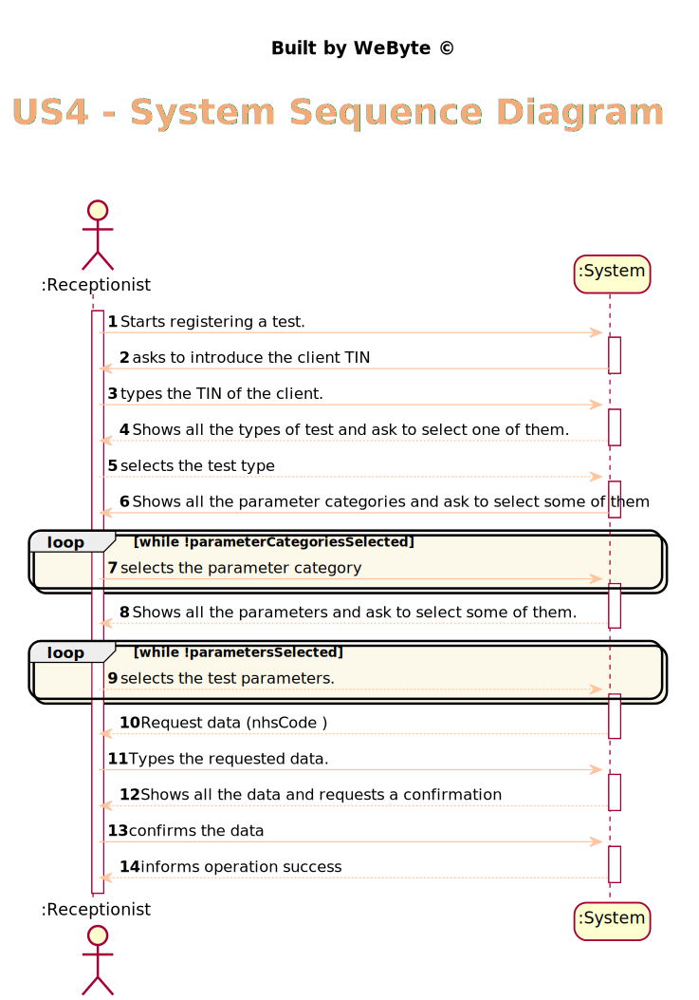
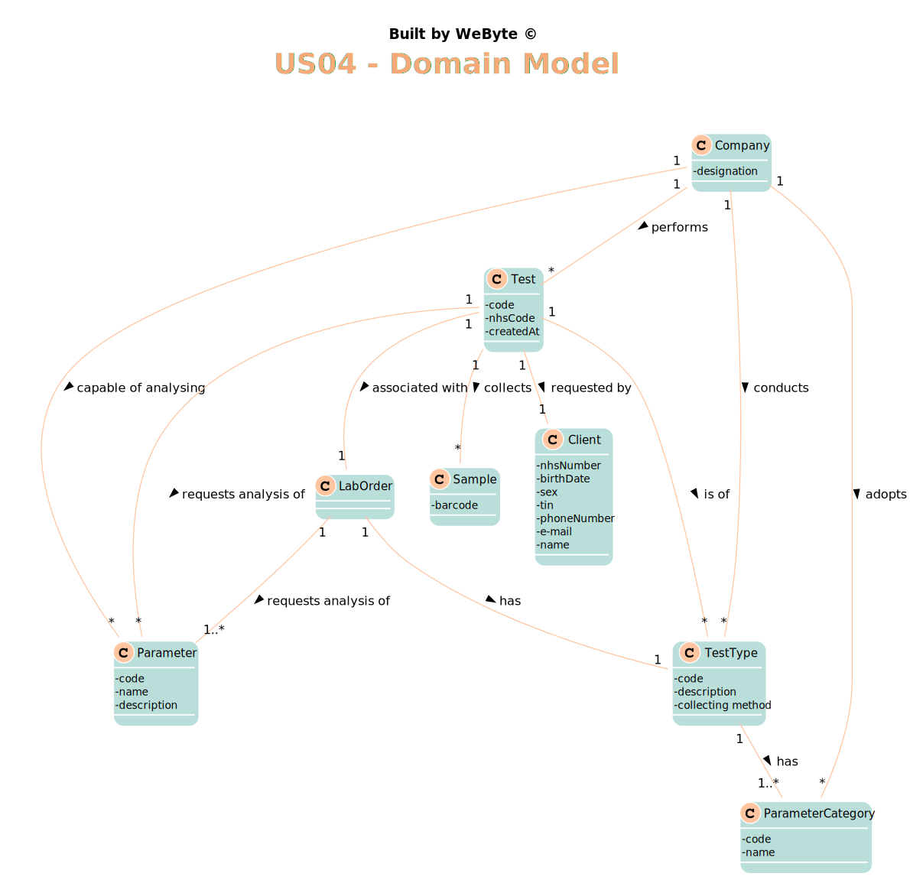
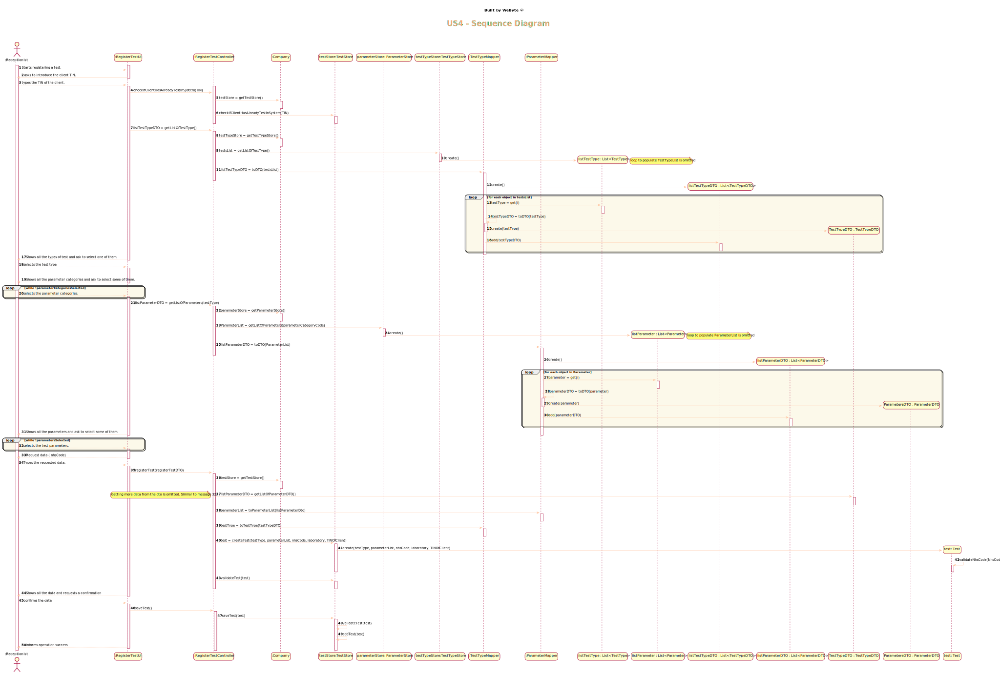
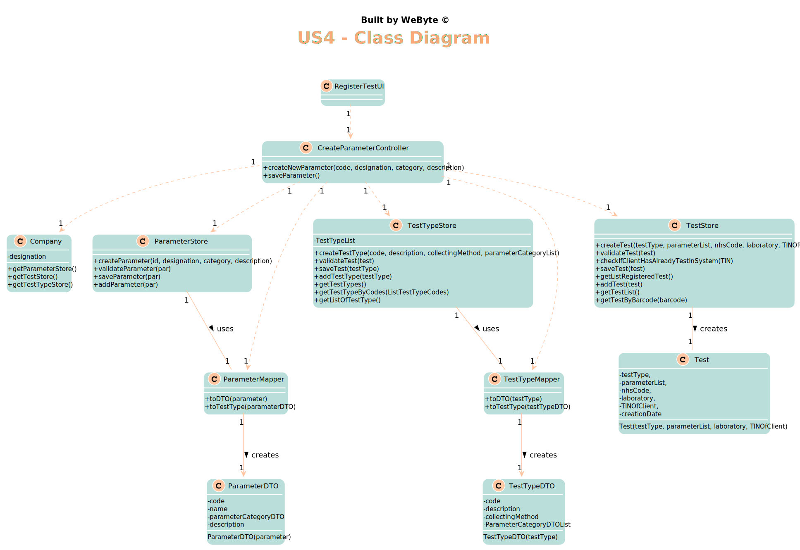

# US 4 - register a test to be performed to a registered client.

## 1. Requirements Engineering

### 1.1. User Story Description

*As a receptionist of the laboratory, I intend to register a test to be performed to a registered client.

### 1.2. Customer Specifications and Clarifications

From the Specifications Document:
* >"the client arrives at one of the clinical analysis laboratories with a lab order prescribed by
  a doctor. Once there, a receptionist asks the client’s citizen card number, the lab order (which
  contains the type of test and parameters to be measured), and registers in the application the test to
  be performed to that client."

* From the client clarifications:

  * > **Q:** When the receptionist chooses the test type, should the categories appear, and then when selecting the category, the receptionist can choose the parameters for the test? Or when the Receptionist chooses the test type, should appear all the parameters that it includes immediately?
    
    > **A:** Firstly, the receptionist should choose a test type. Then choose a category from a set of categories. Last, the receptionist should choose a parameter.
  
  * > **Q:**:What are the attributes of a test and the acceptance criteria?
   
    > **A:** A test has the following attributes:
             Test code : Sequential number with 12 digits. The code is automatically generated.
             NHS code: 12 alphanumeric characters.
      
  * > **Q:** Shouldn't the receptionist locate the Client by the Citizen Card Number instead of TIN Number?

    > **A:** The receptionist should use the TIN number to find the client.

  * > **Q:** You've said on previous questions that the NHS code contains 12 characters and is alphanumeric, so this will be different from the NHS number from the client, am I right? If so, how do we know a certain test is associated to a client?
      
     >**A:** A test has a NHS code and a client has a NHS number. In US4 the receptionist of the laboratory should ask the client to get his TIN number. Using the TIN number the receptionist of the laboratory can find all information about the client. Do not forget that a client should be registered in the system to make a test.

   * > **Q:** Can the client have two identical tests? or the system should stop from creating the same test?
     
     > **A:** test is unique in the system.
     
   * > **Q:** when the receptionist is registering a test for a client, the test can have more than one category and many parameters of the chosen categories or it only can have one category?
     
     > **A:** Each test can have more than one category.

### 1.3. Acceptance Criteria

* AC1: The receptionist must select at least one parameter to be analysed from all possible parameters.
* AC2: The receptionist must select at least one parameter category from all possible parameter categories associated with the test type.
* AC3: The test code must be a sequential number with 12 digits. The code is automatically generated.
* AC4: The NHS code must be a 12 alphanumeric characters.
* AC5: the test type must have an API associated with that test type.

### 1.4. Found out Dependencies

* *There is a dependency to "US7 Register a new employee" since the receptionist must be registered in the system*

* *There is a dependency to "US9 specify a new type of test and its collecting methods" since the parameters are associated to the testType*

* *There is a dependency to "US10 Specify a new parameter and categorize it" since the receptionist selects the parameters to be analysed*

### 1.5 Input and Output Data

Input Data
* Typed data: NHS code
* Selected data: parameter category, parameter, type of test
  
  Output Data
* (In)Success of the operation

### 1.6. System Sequence Diagram (SSD)

*Insert here a SSD depicting the envisioned Actor-System interactions and throughout which data is inputted and outputted to fulfill the requirement. All interactions must be numbered.*

### 1.7 Other Relevant Remarks

*Use this section to capture other relevant information that is related with this US such as (i) special requirements ; (ii) data and/or technology variations; (iii) how often this US is held.*

## 2. OO Analysis

### 2.1. Relevant Domain Model Excerpt
*In this section, it is suggested to present an excerpt of the domain model that is seen as relevant to fulfill this requirement.*

### 2.2. Other Remarks

*Use this section to capture some aditional notes/remarks that must be taken into consideration into the design activity. In some case, it might be usefull to add other analysis artifacts (e.g. activity or state diagrams).*

## 3. Design - User Story Realization

### 3.1. Rationale

**The rationale grounds on the SSD interactions and the identified input/output data.**

| Interaction ID | Question: Which class is responsible for... | Answer  | Justification (with patterns)  |
|:-------------  |:--------------------- |:------------|:---------------------------- |
|Step 1 		 |	... interacting with the actor? | RegisterTestUI   |  Pure Fabrication: there is no reason to assign this responsibility to any existing class in the Domain Model.
|                |  ... coordinating the US? |       RegisterTestController      |   Controller                           |
| Step 2  		 |							 |             |                              |
| Step 3  		 |	... allowing the selection of the TestType |    RegisterTestUI         |    Pure Fabrication: there is no reason to assign this responsibility to any existing class in the Domain Model.         |
| Step 4  		 |							 |             |                              |
| Step 5  		 |	... allowing the selection of the Parameter Categories? |    RegisterTestUI         |    Pure Fabrication: there is no reason to assign this responsibility to any existing class in the Domain Model.         |
|                |  ... knowing the parameter category to show? |       TestType      |   IE: Parameter categories are stored in the TestType .  |
| Step 6 		 |							 |             |                              |
| Step 7  		 |	... allowing the selection of the Parameters? |    RegisterTestUI         |    Pure Fabrication: there is no reason to assign this responsibility to any existing class in the Domain Model.         |
|                |  ... knowing the parameters to show? |       ParameterStore      |   IE: Parameters are stored in the ParameterStore .  |
| Step 8  		 |							 |             |                              |
| Step 9  		 |  ... save the registered test?|    TestStore         |      IE: object created has its own data                        |
|                |  ... instantiating a new Test? |       TestStore      |   Creator    |
|                |... validating all data (local validation)?	         |   Test   |    IE: owns its data.
| Step 10  		 |							 |             |                              |
| Step 11        |	... validating all data (global validation)?         |   TestStore  |  IE: knows all parameters                           |              
|  		         |	... saving the created Test?						 |   TestStore          |   IE: stores all tests                         |              
| Step 12  		 |		... informing operation success?				 |   RegisterTestUI        |   IE: is responsible for user interaction                           |

### Systematization ##

According to the taken rationale, the conceptual classes promoted to software classes are:

* TestType
* Test

Other software classes (i.e. Pure Fabrication) identified:

* RegisterTestUI
* RegisterTestController
* TestStore
* ParameterStore

## 3.2. Sequence Diagram (SD)

*In this section, it is suggested to present an UML dynamic view stating the sequence of domain related software objects' interactions that allows to fulfill the requirement.*

## 3.3. Class Diagram (CD)

*In this section, it is suggested to present an UML static view representing the main domain related software classes that are involved in fulfilling the requirement as well as and their relations, attributes and methods.*

# 4. Tests
*In this section, it is suggested to systematize how the tests were designed to allow a correct measurement of requirements fulfilling.*

**_DO NOT COPY ALL DEVELOPED TESTS HERE_**

**Test 1:** Check that it is not possible to create a report with more than 400 words.
    
    @Test
    public void validateReportTooBig() {
        exceptionRule.expect(IllegalArgumentException.class);
        exceptionRule.expectMessage("This report is invalid, you entered too many words (Max 400 words)");
        test.validateReport(new Report("r a r a r a r a r a r a r a r a r a r a r a r a r a r a r a r a r a r a r a r a r a r a r a r a r a r a r a r a r a r a r a r a r a r a r a r a r a r a r a r a r a r a r a r a r a r a r a r a r a r a r a r a r a r a r a r a r a r a r a r a r a r a r a r a r a r a r a r a r a r a r a r a r a r a r a r a r a r a r a r a r a r a r a r a r a r a r a r a r a r a r a r a r a r a r a r a r a r a r a r a r a r a r a r a r a r a r a r a r a r a r a r a r a r a r a r a r a r a r a r a r a r a r a r a r a r a r a r a r a r a r a r a r a r a r a r a r a r a r a r a r a r a r a r a r a r a r a r a r a r a r a r a r a r a r a r a r a r a r a r a r a r a r a r a r a r a r a r a r a r a r a r a r a r a r a r a r a r a r a r a r a r a r a r a r a r a r a r a r a r a r a r a r a r a r a r a r a r a r a r a  ", "report"));
    }

**Test 2:** Check that it is not possible to have a test with a few parameters with result. all parameters must have result to proceed.
   
    @Test
    public void validateParameterResultMissing() {

        exceptionRule.expect(NullPointerException.class);
        exceptionRule.expectMessage("There is one or more parameters that have no result.");

        test.validateParameterResult();
    }
**Test 3:** Check that it is not possible  to add samples with the test in the incorrect state
   
    @Test
    public void addSampleWrongException() throws OutputException, BarcodeException, IOException, ClassNotFoundException, InstantiationException, IllegalAccessException {
        exceptionRule.expect(IllegalAccessError.class);
        exceptionRule.expectMessage("You cannot add samples to a test that isn't in registered state.");

        test.addSample(1);
        test.addTestResult("HB000", "cheiro fétido", "g/m3");
        test.validateParameterResult();
        test.addSample(1);
        Assert.assertNotEquals(test.getSampleList().size(), 2);
    }

*It is also recommended to organize this content by subsections.*

# 5. Construction (Implementation)

*In this section, it is suggested to provide, if necessary, some evidence that the construction/implementation is in accordance with the previously carried out design. Furthermore, it is recommeded to mention/describe the existence of other relevant (e.g. configuration) files and highlight relevant commits.*

*It is also recommended to organize this content by subsections.*

## CreateTestController

    public class CreateTestController {
    private Company company;
    private TestType c;
    private TestTypeStore store;

    public CreateTestController(){
        this(App.getInstance().getCompany());
    }

    public CreateTestController(Company company){
        this.company = company;

    }

    public void createNewTestType(String code, String description, String collectionMethod, List<ParameterCategory> parameterCategories){
        store = company.getTestTypeStore();
        c = store.createTestType(code, description, collectionMethod, parameterCategories);
        store.validateTest(c);

    }

    public void saveTest(){
        store.saveTest(c);
    }

    public ParameterCategoryStore getParameterCategoryStore() {
        return company.getParameterCategoryStore();
    }

## TestStore

    public class TestStore {

    private final List<Test> testList;

    public TestStore(){
        this.testList = new ArrayList<>();
    }

    public Test createTest(TestType testType, List<Parameter> parameterList, String nhsCode, Laboratory laboratory, String TINOfClient){
        return new Test(testType, parameterList, nhsCode, laboratory,TINOfClient );
    }

    public void validateTest(Test test){
        if(testList.contains(test)){
            throw new IllegalArgumentException("Test with the provided values already exist!");
        }
    }

    public void checkIfClientHasAlreadyTestInSystem(String TIN){
        for(Test t : testList){
            if(t.getTINOfClient().equals(TIN) && t.isValidated()){
                throw new IllegalArgumentException("The Client with the TIN provided have already a test registered in the system.");
            }
        }
    }

    public void saveTest(Test test){
        validateTest(test);
        addTest(test);
    }

    public List<Test> getListRegisteredTest(){
        List<Test> listTest = new ArrayList<>();
        for(Test test : testList){
            if(test.isRegistered()){
                listTest.add(test);
            }
        }
        return listTest;
    }

    private void addTest(Test test){
        testList.add(test);
    }

    public List<Test> getTestList() {
        return testList;
    }

    public Test getTestByBarcode(String barcode){
        for (Test t : testList){
            for(Sample s : t.getSampleList()){
                if (s.getCode().equals(barcode)){
                    return t;
                }
            }

        }
        throw new IllegalArgumentException("The code provided does not match to any other code in database.");
    }
}

# 6. Integration and Demo

*In this section, it is suggested to describe the efforts made to integrate this functionality with the other features of the system.*

# 7. Observations

