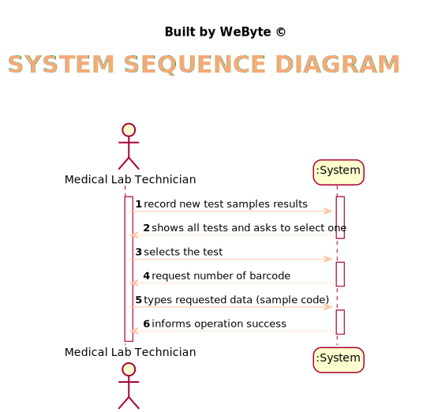
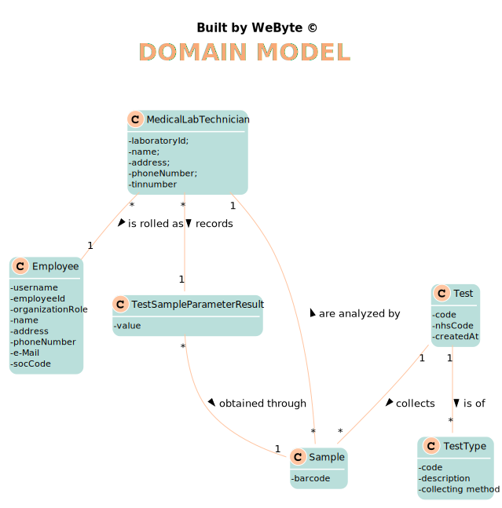
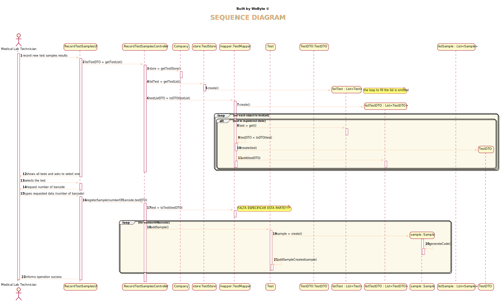
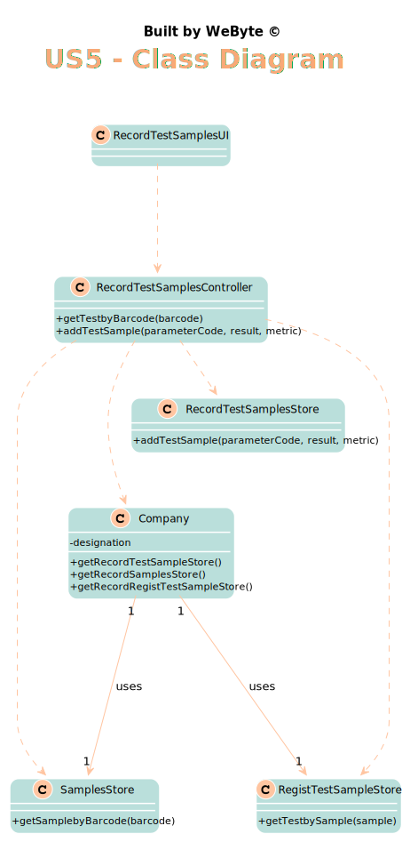

# US 5 - Record the samples collected in the scope of a given test

## 1. Requirements Engineering

### 1.1. User Story Description

*As a medical lab technician, I want to record the samples collected in the scope of a given test*

### 1.2. Customer Specifications and Clarifications
From the Specifications Document:
* >"All the tests (clinical blood tests and Covid-19 tests) performed by the network of laboratories are
registered locally by the medical lab technicians who collect the samples. The samples are sent
daily to the chemical laboratory where the chemical analyses are performed, and results obtained.
When sampling (blood or swab) the medical lab technician records the samples in the system,
associating the samples with the client/test, and identifying each sample with a barcode that is
automatically generated using an external API."

From the client clarifications:
>**Q:** Regarding US5, after selecting the number of samples for the test chosen by the medical lab tec., should the barcodes be displayed on the screen, or just printed and saved?

>**A:** Should be saved in a file. 

>**Q:** Is there a specific order/priority for the medical lab technician to select the test to which he wants to collect the samples, or is the selection random? If there is an order, how is a test chosen?

>**A:** The medical lab technician selects the test and the system generates the barcodes.
From a previous post: "The medical lab technician selects a test and the system asks for the number of samples to collect".

>**Q:** It was answered in one of the previous questions that the sample only has one attribute, the barcode, however the description of the project also mentions a date of collection of the samples, is this date supposed to be an attribute of the test and not of the sample itself?

>**A:** Yes. The system should record the date (DD/MM/YYYY) and time (HH:MM) when the sample is collect made. The date and time are automatically generated by the system when the barcode is issued.

>**Q:** Shouldn't there be a way for technicians to add more samples to an existing test?Shouldn't there be a way for technicians to add more samples to an existing test?

>**A:** No
 
>**Q:** Should there be a validation of the number of samples?
 
> >**A:** No.
 
> >**Q:** After the barcodes are generated. The concept-reality link would be, for example to stick each barcode into each sample?
 
> >**A:** Yes. Each generated barcode should be saved in a folder as a jpeg file.

### 1.3. Acceptance Criteria

*AC1- The system should support several barcode APIs.

*AC2- The API to use is defined by configuration.

*AC3- Each generated barcode should be saved in a folder as a jpeg file.

*AC4- Record the date and time  when the sample is collect made

### 1.4. Found out Dependencies

* *There is a dependency to "US4 Register a client. " since it is required to associate the samples to the test.*
* *There is a dependency to "US12 Record the results of a given test." since to obtain results will also be used for the samples.*

### 1.5 Input and Output Data

Input Data
* Typed data: Barcode
* Selected Data:Samples collected from a test
* Output Data: Results of each sample collected from a test *

### 1.6. System Sequence Diagram (SSD)

*Insert here a SSD depicting the envisioned Actor-System interactions and throughout which data is inputted and outputted to fulfill the requirement. All interactions must be numbered.*

### 1.7 Other Relevant Remarks

## 2. OO Analysis

### 2.1. Relevant Domain Model Excerpt

### 2.2. Other Remarks

*Use this section to capture some aditional notes/remarks that must be taken into consideration into the design activity. In some case, it might be usefull to add other analysis artifacts (e.g. activity or state diagrams).*

## 3. Design - User Story Realization

### 3.1. Rationale
**The rationale grounds on the SSD interactions and the identified input/output data.**

| Interaction ID | Question: Which class is responsible for... | Answer  | Justification (with patterns)  |
|:-------------  |:--------------------- |:------------|:---------------------------- |
|Step 1 		 |	... interacting with the actor? | RecordTestSamplesUI   |  Pure Fabrication: there is no reason to assign this responsibility to any existing class in the Domain Model.
|                |  ... coordinating the US? |       RecordTestSamplesController      |   Controller                           |
|                |  ... knowing the parameter category to show? |       TestStore      |   IE: Categories are stored in the TestStore .  |
| Step 2  		 |							 |             |                              |
| Step 3  		 |	... allowing the selection of the Category |    RecordTestSamplesUI         |    Pure Fabrication: there is no reason to assign this responsibility to any existing class in the Domain Model.         |
| Step 4  		 |							 |             |                              |
| Step 5  		 |  ... save the new Parameter|    TestStore         |      IE: object created has its own data                        |
|                |  ... instantiating a new Laboratory? |       TestStore      |   Creator    |
| Step 6  		 |							 |             |                              |              
| Step 7  		 |	... validating all data (local validation)?	         |   Parameter   |    IE: owns its data.                          |              
|  		         |	... validating all data (global validation)?         |   TestStore  |  IE: knows all parameters                           |              
|  		         |	... saving the created task?						 |   TestStore          |   IE: stores all parameters                         |              
| Step 8  		 |		... informing operation success?				 |   RecordTestSampleUI        |   IE: is responsible for user interaction                           |

### Systematization ##

According to the taken rationale, the conceptual classes promoted to software classes are:

 * Test

Other software classes (i.e. Pure Fabrication) identified:
* RecordTestSamplesUI
* RecordTestSamplesController
* TestStore

## 3.2. Sequence Diagram (SD)

*In this section, it is suggested to present an UML dynamic view stating the sequence of domain related software objects' interactions that allows to fulfill the requirement.*

## 3.3. Class Diagram (CD)

*In this section, it is suggested to present an UML static view representing the main domain related software classes that are involved in fulfilling the requirement as well as and their relations, attributes and methods.*

# 4. Tests
*In this section, it is suggested to systematize how the tests were designed to allow a correct measurement of requirements fulfilling.*

**_DO NOT COPY ALL DEVELOPED TESTS HERE_**

**Test 1:** Checks that one parameter category is not equal to another.

    @Test
    public void testEqualsFalse() {
        ParameterCategory pc1 = new ParameterCategory("12346", "Category");
        ParameterCategory pc2 = new ParameterCategory("12332", "Hemograma");
        Assert.assertEquals(false, pc1.equals(pc2));
    }

**Test 2:** Checks that a parameter category cannot have a name longer than 10 characters.

    @Test
    public void checkNameBig() {
        exceptionRule.expect(IllegalArgumentException.class);
        exceptionRule.expectMessage("Name cannot be longer than 10 characters");
        pc.checkNameRules("123111111111111111");
    }

**Test 3:** Checks that a new parameter category is added to the list containing all parameter categories.

    @Test
    public void add() {
      store.add(pc);
      store.getParameterCategoryList().contains(pc);
    }

**Test 4:** Checks that the parameter category that has the same description as the one passed by parameter is returned.

    @Test
    public void getParameterCategoryByDescription() {
        store.add(pc);
        store.getParameterCategoryByDescription(pc.getName());
        System.out.println(store.getParameterCategoryByDescription(pc.getName()));
        Assert.assertEquals(true, store.getParameterCategoryByDescription(pc.getName()).equals(pc));
    }

*It is also recommended to organize this content by subsections.*

# 6. Integration and Demo

*Since this User Story is independent, it was not needed to estabilish a connection to any User Storie.*

# 7. Observations

* Method create has too many parameters. Maybe the use of DTOs, can solve the issue.
* Using DTO on roles, would allow to make a difference between all employees and the specialist doctor, becoming easier to maintain and promoting Polymorphism.

