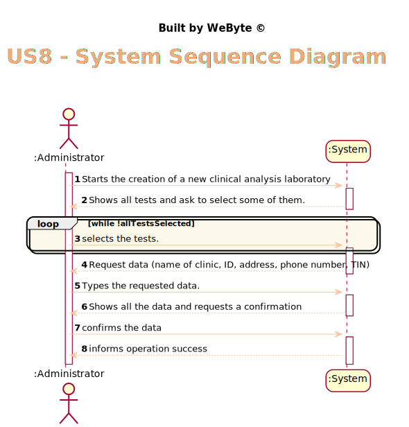
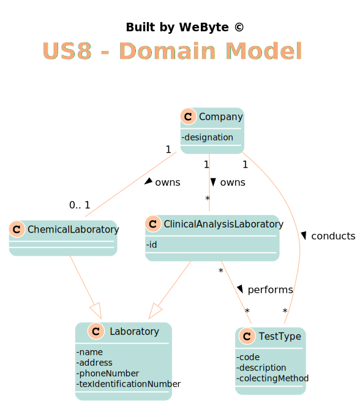
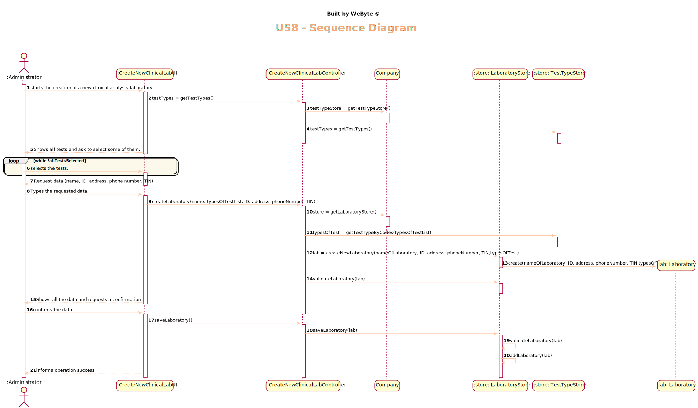
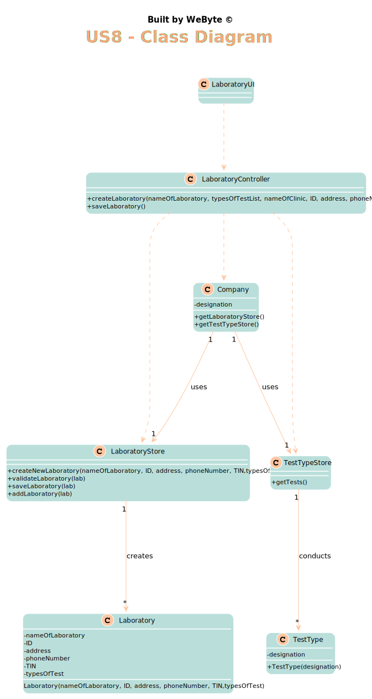

# US 8 - Register a new clinical analysis laboratory stating which kind of test(s) it operates.

## 1. Requirements Engineering

### 1.1. User Story Description

*As an administrator, I want to register a new clinical analysis laboratory stating which kind of test(s) it operates*

### 1.2. Customer Specifications and Clarifications

From the Specifications Document:

  >"Many Labs is an English company that has a network of clinical analysis laboratories and that wants
an application to manage the clinical analyses performed in its laboratories."
* From the client clarifications:

  * >**Q**: Is there a maximum limit of types of tests a clinical analysis laboratory can operate?
  
    > **A:** No.

  * >**Q:** We know through the specifications document that "All Many Labs clinical analysis laboratories perform clinical blood tests".
   My question therefore is: When creating a new Clinical Analysis Laboratory, should the system automatically record that it operates that type of test or should the person who is creating it select it manually while selecting other types of tests? Or other option?

    > **A:** The administrator should select, manually, all the types of tests to be performed by the Clinical Analysis Laboratory.
  
  * >**Q:** Are the test types in US8 typed in or selected from those that the program has?
  
    >**A:** The test types are selected from a list.
    
  * >    **Q:** (...)And what about the Clinical Analysis Laboratory and Chemical Laboratory? Do they have common attributes like an identification number, number of employees who work there, location, etc.?
    
    > **A:** (...)Each Clinical Analysis Laboratory is characterized by the following attributes:
    Laboratory ID;
    Name;
    Address;
    Phone Number;
    TIN number.
    
   * >**Q:** Q: Are two Clinical Analysis Laboratories with the same:
     a) Laboratory ID OR
     b) name OR
     c) address OR
     d) phone Number OR
     e) TIN number
    
    > **A** Only the name of two CAL can be same.
allowed to exist?

### 1.3. Acceptance Criteria

* AC1: The name, phone number, address, ID of the laboratory and the TIN cannot be blank.
* AC2: Needs to operate at least 1 test.
* AC3: The test type must be known by the application.
* AC4: The same laboratory cannot be registered twice.
* AC5: The lab ID is made of five alphanumeric characters.
* AC6: The name of lab can't have more than 20 characters.
* AC7: The lab address is a string with no more than 30 characters.
* AC8: the phone number 11 digit number.
* AC9: The TIN number is a 10 digit number
* AC10: Only the name of the lab can be duplicated with one already created.
### 1.4. Found out Dependencies

*There is a dependency to "US9 specify a new type of test and its collecting methods" since at least one type of test must exist to register a new laboratory.

### 1.5 Input and Output Data

Input Data
* Typed data: name of the laboratory, laboratory ID, address, phone number, TIN. 
* Selected data: test(s) it operates
  Output Data
* (In)Success of the operation

### 1.6. System Sequence Diagram (SSD)

*Insert here a SSD depicting the envisioned Actor-System interactions and throughout which data is inputted and outputted to fulfill the requirement. All interactions must be numbered.*

### 1.7 Other Relevant Remarks

*Use this section to capture other relevant information that is related with this US such as (i) special requirements ; (ii) data and/or technology variations; (iii) how often this US is held.*

## 2. OO Analysis

### 2.1. Relevant Domain Model Excerpt
*In this section, it is suggested to present an excerpt of the domain model that is seen as relevant to fulfill this requirement.*

### 2.2. Other Remarks

*Use this section to capture some additional notes/remarks that must be taken into consideration into the design activity. In some case, it might be usefull to add other analysis artifacts (e.g. activity or state diagrams).*

## 3. Design - User Story Realization

### 3.1. Rationale

**The rationale grounds on the SSD interactions, and the identified input/output data.**

| Interaction ID | Question: Which class is responsible for... | Answer  | Justification (with patterns)  |
|:-------------  |:--------------------- |:------------|:---------------------------- |
|Step 1 		 |	... interacting with the actor? | LaboratoryUI   |  Pure Fabrication: there is no reason to assign this responsibility to any existing class in the Domain Model.
|                |  ... coordinating the US? |       LaboratoryController      |   Controller                           |
|                |  ... knowing the type of test to show? |       TestTypeStore      |   IE: Type of Tests are stored in the TestTypeStore.  |
| Step 2  		 |							 |             |                              |
| Step 3  		 |	... allowing the selection of the test |    LaboratoryUI         |    Pure Fabrication: there is no reason to assign this responsibility to any existing class in the Domain Model.         |
| Step 4  		 |							 |             |                              |
| Step 5  		 |  ... save the new Lab     |    LaboratoryStore         |      IE: object created has its own data                        |
|                |  ... instantiating a new Laboratory? |       LaboratoryStore      |   Creator    |
| Step 6  		 |							 |             |                              |              
| Step 7  		 |	... validating all data (local validation)?	         |   Laboratory   |    IE: owns its data.                          |              
|  		         |	... validating all data (global validation)?         |   LaboratoryStore  |  IE: knows all labs                             |              
|  		         |	... saving the created Laboratory?						 |   LaboratoryStore          |   IE: stores all labs                           |              
| Step 8  		 |		... informing operation success?					 |     LaboratoryUI        |   IE: is responsible for user interaction                           |              

### Systematization ##

According to the taken rationale, the conceptual classes promoted to software classes are:

* Laboratory

Other software classes (i.e. Pure Fabrication) identified:
* LaboratoryUI
* LaboratoryController
* LaboratoryStore
* TestTypeStore

## 3.2. Sequence Diagram (SD)

*In this section, it is suggested to present an UML dynamic view stating the sequence of domain related software objects' interactions that allows to fulfill the requirement.*

## 3.3. Class Diagram (CD)

*In this section, it is suggested to present an UML static view representing the main domain related software classes that are involved in fulfilling the requirement as well as and their relations, attributes and methods.*

# 4. Tests
*In this section, it is suggested to systematize how the tests were designed to allow a correct measurement of requirements fulfilling.*

**_DO NOT COPY ALL DEVELOPED TESTS HERE_**

**Test 1:** Check that it is not possible to create a laboratory with a duplicated ID.

	@Test
    public void checkDuplicatedID(){
        exceptionRule.expect(IllegalArgumentException.class);
        exceptionRule.expectMessage("There is a lab with the same ID already created.");
        Laboratory l2 = new Laboratory("lab2", "12345", "ol1a", "12325678901", "1214567890", list);;
        LaboratoryStore l = new LaboratoryStore();
        l.add(emp);
        l.checkDuplicatedData(l2);

    }
**Test 2:** Check that it is not possible to create a laboratory tha have been already created.

	@Test
    public void validateLaboratoryError() {
        exceptionRule.expect(IllegalArgumentException.class);
        exceptionRule.expectMessage("laboratory has already been created" );
        LaboratoryStore l = new LaboratoryStore();
        l.add(emp);
        Laboratory l2 = new Laboratory("lab1", "12345", "ola", "12345678901", "1234567890", list);;
        l.validateLaboratory(l2);

    }
**Test 3:** Check that it is not possible to create a laboratory without a name

    @Test
    public void checkNameIsEmpty(){
        exceptionRule.expect(IllegalArgumentException.class);
        exceptionRule.expectMessage("Name of laboratory cannot be empty.");

        emp.checkSizes("", "12345", "fal", "12345678901", "1234567890");

    }
**Test 4:** Check that it is not possible to create a laboratory with a big value in the TIN (more than 10 digits).

    @Test
    public void checkSizesTINBig() {
        exceptionRule.expect(IllegalArgumentException.class);
        exceptionRule.expectMessage("TIN number must have 10 digits.");
        emp.checkSizes("lab1", "12345", "fal", "12345678901", "12345678901");

    }

*It is also recommended to organize this content by subsections.*

# 5. Construction (Implementation)

*In this section, it is suggested to provide, if necessary, some evidence that the construction/implementation is in accordance with the previously carried out design. Furthermore, it is recommeded to mention/describe the existence of other relevant (e.g. configuration) files and highlight relevant commits.*

*It is also recommended to organize this content by subsections.*

##LaboratoryController
    public class LaboratoryController {

       
        private Laboratory lab;
        private LaboratoryStore labStore;
        private Company company;
    
        public LaboratoryController() {
            this(App.getInstance().getCompany());
    
        }
    
        
        public LaboratoryController(Company company) {
            this.company = company;
            this.lab = null;
    
        }
        
        public void createLaboratory(String name, String ID, String address, String phoneNumber, String TIN, List<String> testTypeCodes){
            labStore = company.getLaboratoryStore();
            TestTypeStore testStore = company.getTestTypeStore();
            List<TestType> testTypes = testStore.getTestTypeByCodes(testTypeCodes);
            lab = labStore.createNewLaboratory(name,ID,address,phoneNumber,TIN,testTypes);
            labStore.validateLaboratory(lab);
        }
    
        public List<String> getTestTypes(){
            TestTypeStore testTypeStore = company.getTestTypeStore();
            return testTypeStore.getTestTypes();
        }
    
        public void saveLaboratory(){
            labStore.saveLaboratory(lab);
        }
    }

##LaboratoryStore

    public class LaboratoryStore {

        public class LaboratoryStore {
        
        private final List<Laboratory> store = new ArrayList<>();
    
        
        public LaboratoryStore() {
    
        }
    
        public Laboratory createNewLaboratory(String nameOfLaboratory, String ID, String address, String phoneNumber, String TIN, List<TestType> testType) {
    
            return new Laboratory(nameOfLaboratory, ID, address, phoneNumber, TIN, testType);
        }
    
    
        public void validateLaboratory(Laboratory lab) {
            if (store.contains(lab)) {
                throw new IllegalArgumentException("laboratory has already been created");
            }
            checkDuplicatedData(lab);
        }
    
    
        public void checkDuplicatedData(Laboratory lab){
            for(Laboratory laboratory : store){
                if(laboratory.getAddress().equals(lab.getAddress())){
                    throw new IllegalArgumentException("There is a lab with the same address already created.");
                }
                if(laboratory.getID().equals(lab.getID())){
                    throw new IllegalArgumentException("There is a lab with the same ID already created.");
                }
                if(laboratory.getPhoneNumber().equals(lab.getPhoneNumber())){
                    throw new IllegalArgumentException("There is a lab with the same phone number already created.");
                }
                if(laboratory.getTIN().equals(lab.getTIN())){
                    throw new IllegalArgumentException("There is a lab with the same TIN already created.");
                }
            }
        }
    
        public boolean add(Laboratory lab) {
            if (lab != null) {
                if (!store.contains(lab)) {
                    store.add(lab);
                    return true;
                }
            }
            return false;
        }
    
    
        public void saveLaboratory(Laboratory lab) {
            validateLaboratory(lab);
            add(lab);
    
        }
    }

# 6. Integration and Demo

*In this section, it is suggested to describe the efforts made to integrate this functionality with the other features of the system.*

# 7. Observations

* The checkDuplicatedData() can be separated into many smaller methods to assure High Cohesion
* Some methods have too many parameters. Maybe the use of DTOs can solve this issue.

