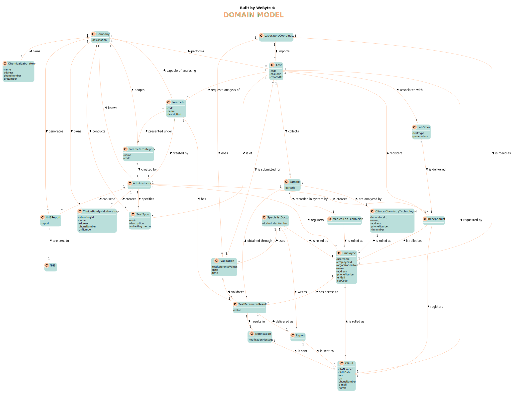

# OO Analysis #

The construction process of the domain model is based on the client specifications, especially the nouns (for _concepts_) and verbs (for _relations_) used. 

## Rationale to identify domain conceptual classes ##
To identify domain conceptual classes, start by making a list of candidate conceptual classes inspired by the list of categories suggested in the book "Applying UML and Patterns: An Introduction to Object-Oriented Analysis and Design and Iterative Development". 

### _Conceptual Class Category List_ ###

**Business Transactions**

*  Test

---

**Transaction Line Items**

*  Sample
*  LabOrder

---

**Product/Service related to a Transaction or Transaction Line Item**

*  Parameter
*  Notification

---

**Transaction Records**

*  Report
*  DailyReport

---  

**Roles of People or Organizations**

*   Client
*   Administrator
*   Receptionist
*   Medical lab technician
*   Clinical chemistry technologist
*   Laboratory coordinator
*   SpecialistDoctor
*   Employee

---

**Places**

*  Clinical Analysis Laboratory
*  Chemical Laboratory

---

**Noteworthy Events**

* TestParameterResult

---

**Physical Objects**

* Sample

---

**Descriptions of Things**

* TestType
* ParameterCategory
* Parameter

---

**Organizations**

*  Company
*  NHS

---

**Other External/Collaborating Systems**

*  Validation

---

**Documents mentioned/used to perform some work/**

*  Report
*  DailyReport
*  LabOrder

---

### **Rationale to identify associations between conceptual classes** ###

An association is a relationship between instances of objects that indicates a relevant connection and that is worth of remembering, or it is derivable from the List of Common Associations: 

+ **_A_** is physically or logically part of **_B_**
+ **_A_** is physically or logically contained in/on **_B_**
+ **_A_** is a description for **_B_**
+ **_A_** known/logged/recorded/reported/captured in **_B_**
+ **_A_** uses or manages or owns **_B_**
+ **_A_** is related with a transaction (item) of **_B_**
+ etc.

| Concept (A) 		|  Association   	|  Concept (B) |
|----------	   		|:-------------:		|------:       |
|Administrator|creates|ClinicalAnalysisLaboratory|
| |registers|Employee|
| |creates|Receptionist|
| |specifies|TestType|
|Client|is rolled as|Employee|
|ClinicalChemistryTechnologist|is rolled as|Employee|
|Company|owns|ChemicalLaboratory|
| |owns|ClinicalAnalysisLaboratory|
| |generates|DailyReport|
| |capable of analysing|Parameter|
| |adopts|ParameterCategory|
| |performs|Test|
| |conducts|TestType|
| |knows|Administrator|
|DailyReport|are sent to|NHS|
|Employee|has access to|TestParameterResult|
|LaboratoryCoordinator|does|Validation|
| |is rolled as|Employee|
|LabOrder|is delivered|Receptionist|
|MedicalLabTechnician|is rolled as|Employee|
|Notification|is sent|Client|
|Parameter|created by|Administrator|
| |presented under|ParameterCategory|
| |has|TestParameterResult|
|ParameterCategory|created by|Administrator|
|Receptionist|registers|Client|
| |registers|Test|
| |is rolled as|Employee|
|Report|is sent to|Client|
|Sample|are analysed by|ClinicalChemistryTechnologist|
| |recorded|MedicalLabTechnician|
|SpecialistDoctor|is rolled as|Employee|
| |writes|Report|
| |uses|Validation|
|Test|is submitted for|Validation|
| |requests analysis of|Parameter|
| |collects|Sample|
| |is of|TestType|
| |requested by|Client|
| |associated with|LabOrder|
|TestParameterResult|delivered as|Report|
| |obtained through|Sample|
| |results in|Notification|
|Validation|validates|TestParameterResult|

## Domain Model

**Do NOT forget to identify concepts atributes too.**

**Insert below the Domain Model Diagram in a SVG format**

