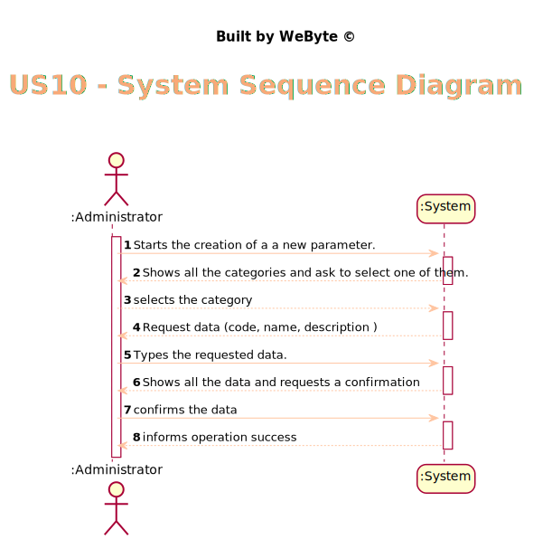
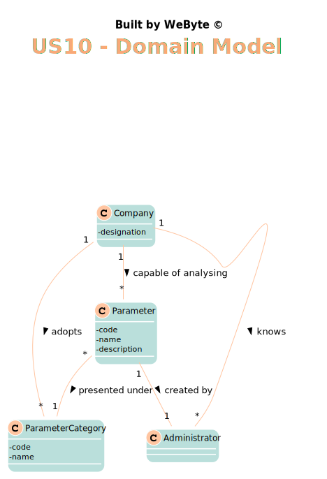
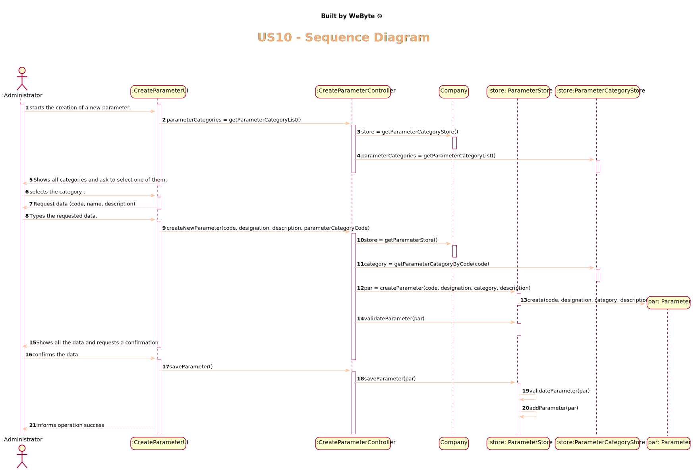
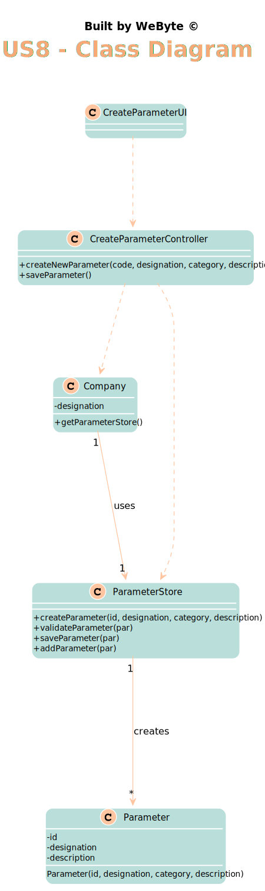

# US 10 - Specify a new parameter and categorize it

## 1. Requirements Engineering

### 1.1. User Story Description

*As an administrator, I want to specify a new parameter and categorize it*
### 1.2. Customer Specifications and Clarifications

From the Specifications Document:
* >"Blood tests are frequently characterized by measuring several parameters which for
  presentation/reporting purposes are organized by categories. For example, parameters such
  as the number of Red Blood Cells (RBC), White Blood Cells (WBC) and Platelets (PLT) are
  usually presented under the blood count (Hemogram) category"
  
  > "Regardless, such tests rely on measuring one
  or more parameters that can be grouped/organized by categories."
* From the client clarifications:

  * >**Q:** What is the data that characterize a parameter? Should we follow the same data as the parameter category, for example, would each parameter have its own code, description and NHS identifier?

    > **A:** Each parameter is associated with one category. Each parameter has a Code, a Short Name and a Description.
The Code are five alphanumeric characters. The Short Name is a String with no more than 8 characters. The Description is a String with no more than 20 characters."

  * >**Q:** Can a parameter be classified in more than one parameter category?
    
    >**A:** No. Each parameter has only one category. There are no subcategories.

  * >**Q:** Is the categorization of a parameter mandatory or optional?
    
    >**A:** Yes.

### 1.3. Acceptance Criteria

* AC1: Each parameter is associated with one category.
* AC2: The Code are five alphanumeric characters.
* AC3: The Short Name is a String with no more than 8 characters
* AC4: The Description is a String with no more than 20 characters.
* AC5: The same parameter cannot be registered twice.
* AC6: All required fiels must be filled in.

### 1.4. Found out Dependencies

*There is a dependency to "US11 Specify a new parameter category" since at least one category must exist to classify  the parameter created*

### 1.5 Input and Output Data

Input Data
* Typed data: Code, Name, Description. 
* Selected data: category
  Output Data
* (In)Success of the operation

### 1.6. System Sequence Diagram (SSD)

*Insert here a SSD depicting the envisioned Actor-System interactions and throughout which data is inputted and outputted to fulfill the requirement. All interactions must be numbered.*

### 1.7 Other Relevant Remarks

*Use this section to capture other relevant information that is related with this US such as (i) special requirements ; (ii) data and/or technology variations; (iii) how often this US is held.*

## 2. OO Analysis

### 2.1. Relevant Domain Model Excerpt
*In this section, it is suggested to present an excerpt of the domain model that is seen as relevant to fulfill this requirement.*

### 2.2. Other Remarks

*Use this section to capture some aditional notes/remarks that must be taken into consideration into the design activity. In some case, it might be usefull to add other analysis artifacts (e.g. activity or state diagrams).*

## 3. Design - User Story Realization

### 3.1. Rationale

**The rationale grounds on the SSD interactions and the identified input/output data.**

| Interaction ID | Question: Which class is responsible for... | Answer  | Justification (with patterns)  |
|:-------------  |:--------------------- |:------------|:---------------------------- |
|Step 1 		 |	... interacting with the actor? | ParameterUI   |  Pure Fabrication: there is no reason to assign this responsibility to any existing class in the Domain Model.
|                |  ... coordinating the US? |       ParameterController      |   Controller                           |
|                |  ... knowing the parameter category to show? |       ParameterCategoryStore      |   IE: Parameter categories are stored in the ParameterCategoryStore .  |
| Step 2  		 |							 |             |                              |
| Step 3  		 |	... allowing the selection of the Category |    ParameterUI         |    Pure Fabrication: there is no reason to assign this responsibility to any existing class in the Domain Model.         |
| Step 4  		 |							 |             |                              |
| Step 5  		 |  ... save the new Parameter|    ParameterStore         |      IE: object created has its own data                        |
|                |  ... instantiating a new parameter? |       ParameterStore      |   Creator    |
| Step 6  		 |							 |             |                              |              
| Step 7  		 |	... validating all data (local validation)?	         |   Parameter   |    IE: owns its data.                          |              
|  		         |	... validating all data (global validation)?         |   ParameterStore  |  IE: knows all parameters                           |              
|  		         |	... saving the created parameter?						 |   ParameterStore          |   IE: stores all parameters                         |              
| Step 8  		 |		... informing operation success?				 |   ParameterUI        |   IE: is responsible for user interaction                           |

### Systematization ##

According to the taken rationale, the conceptual classes promoted to software classes are:

* Parameter

Other software classes (i.e. Pure Fabrication) identified:
* ParameterUI
* ParameterController
* ParameterStore
* ParameterCategoryStore

## 3.2. Sequence Diagram (SD)

*In this section, it is suggested to present an UML dynamic view stating the sequence of domain related software objects' interactions that allows to fulfill the requirement.*

## 3.3. Class Diagram (CD)

*In this section, it is suggested to present an UML static view representing the main domain related software classes that are involved in fulfilling the requirement as well as and their relations, attributes and methods.*

# 4. Tests
*In this section, it is suggested to systematize how the tests were designed to allow a correct measurement of requirements fulfilling.*

**_DO NOT COPY ALL DEVELOPED TESTS HERE_**

**Test 1:** Check that it is not possible to create an instance of the Example class with null values.

	@Test(expected = IllegalArgumentException.class)
		public void ensureNullIsNotAllowed() {
		Exemplo instance = new Exemplo(null, null);
	}

*It is also recommended to organize this content by subsections.*

# 5. Construction (Implementation)

*In this section, it is suggested to provide, if necessary, some evidence that the construction/implementation is in accordance with the previously carried out design. Furthermore, it is recommeded to mention/describe the existence of other relevant (e.g. configuration) files and highlight relevant commits.*

*It is also recommended to organize this content by subsections.*

##CreateParameterController

    public class CreateParameterController {

      private Company company;
      private Parameter parameter;
      private ParameterStore parameterStore;
      private ParameterCategoryStore parameterCategoryStore ;

      public CreateParameterController() {
          this(App.getInstance().getCompany());
  
      }

      public CreateParameterController(Company company) {
          this.company = company;
          this.parameterCategoryStore = company.getParameterCategoryStore();
          this.parameterStore = company.getParameterStore();
      }

      public void createNewParameter(String code, String name, String description, String parameterCategoryDescription){
          ParameterCategory category = parameterCategoryStore.getParameterCategoryByDescription(parameterCategoryDescription);
          if(category == null){ //cannot create a parameter without category....
              throw  new IllegalArgumentException("Category is null");
          }
  
          parameter = parameterStore.createParameter(code,name,description, category);
          parameterStore.validateParameter(parameter);
      }

      public void saveParameter(){
          parameterStore.saveParameter(parameter);
      }

      public List<String> getParameterCategories(){
          parameterCategoryStore = company.getParameterCategoryStore();
          List<String> parameterCategoryString = new ArrayList<>();
          for (ParameterCategory pc : parameterCategoryStore.getParameterCategoryList()){
              parameterCategoryString.add(pc.getDescription());
          }
          return parameterCategoryString;
      }

    }

##ParameterStore

    public class ParameterStore {

      private List<Parameter> parameterList;

      public ParameterStore(){
          parameterList = new ArrayList<>();
      }

      public Parameter createParameter(String code, String name, String description , ParameterCategory category){
          return new Parameter(code, name, category, description);
      }

      public void validateParameter(Parameter parameter){
          if (parameterList.contains(parameter)){
              throw new IllegalArgumentException("The parameter has already been created.");
          }
      }

      public void saveParameter(Parameter parameter){
          validateParameter(parameter);
          addParameter(parameter);
      }

      public void addParameter(Parameter parameter){
          parameterList.add(parameter);
      }
    }

# 6. Integration and Demo

*In this section, it is suggested to describe the efforts made to integrate this functionality with the other features of the system.*

# 7. Observations

* Some methods have too many parameters. The use of DTOs can solve that

