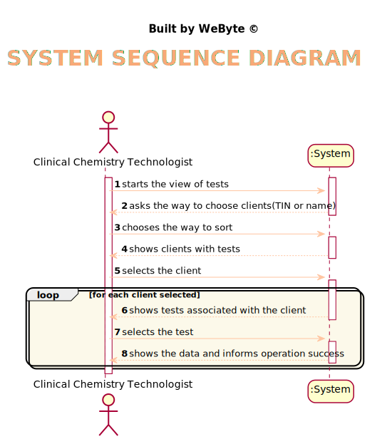
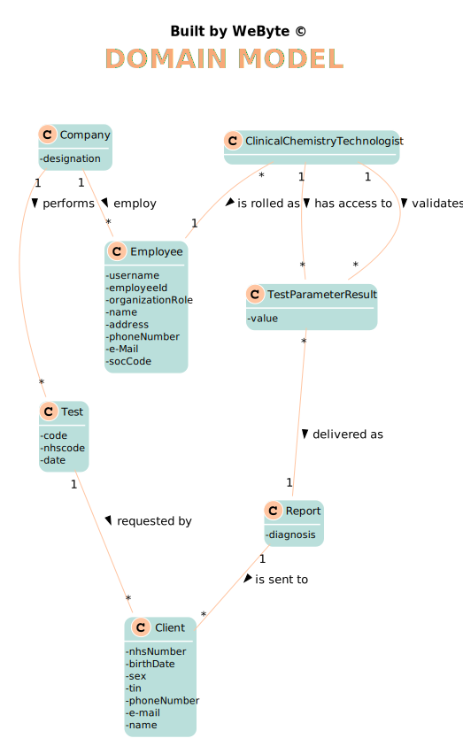
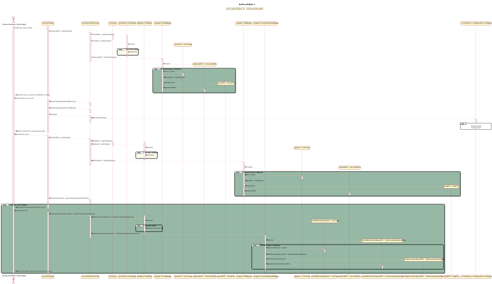
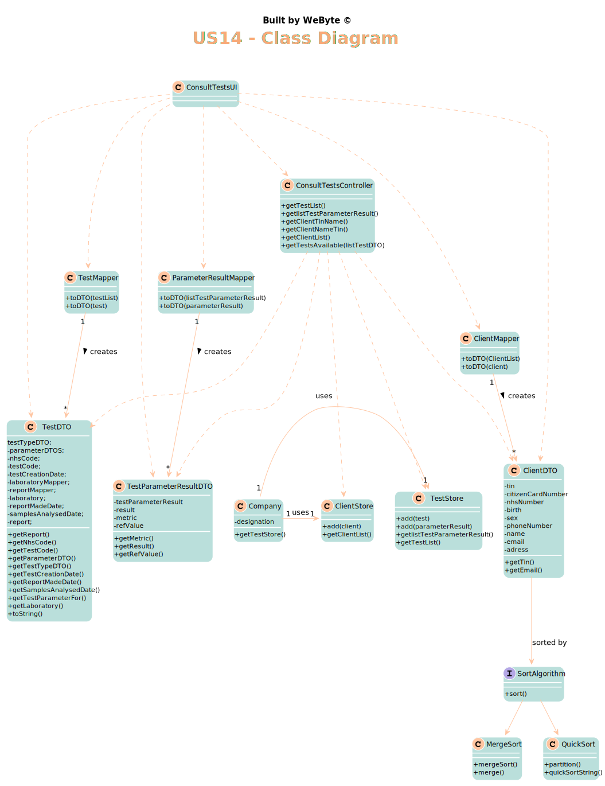

# US 13 - Consult the historical tests performed by a particular client

## 1. Requirements Engineering

### 1.1. User Story Description

*As a clinical chemistry technologist, I intend to consult the historical tests
performed by a particular client and to be able to check tests details/results.*

### 1.2. Customer Specifications and Clarifications

From the Specifications Document:
* >"At the same time the results are also available in the central application where the medical lab technicians who collect the samples, the clinical chemistry technologist, the specialist doctor, and the laboratory coordinator can check them.  
  
* From the client clarifications:
> **Q**: In US13 acceptance criteria, "The application must allow ordering the clients by TIN and by name...". What do you mean by that? Is there a priority in ordering between name and TIN?  
> **A** : The user can chose to sort the clients by name OR by TIN.

> **Q**: In US13, the Clinical Chemistry Technologist, can select more than one client at once to view its historical test results?  
> **A**: No.

> **Q**: Moreover, will all the tests associated with the client be displayed or the clinical chemistry technologist will have also to select the tests he wants to see?    
> **A** : After selecting one client, the application should show all the historical test results, of that client, to the Clinical Chemistry Technologist.

> **Q**: Should the user be the one selecting if the Clients are ordered by Name or TIN, or should it be defined through the configuration file? If it is the user, how should he be able to select it?  
> **A**: When using the application, the clinical chemistry technologist should be able to sort the clients by name or TIN.
The algorithm that will be used to sort the data should be defined through a configuration file.

> **Q**: From the user story description "As a clinical chemistry technologist, I intend to consult the historical tests performed by a particular client and to be able to check tests details/results". What do you mean by "check tests details/results" ?      
> **A** : The clinical chemistry technologist should be able to check the historical tests performed by a particular client and see the results obtained in each test. For a given client (that was selected by the clinical chemistry technologist) the application should show all tests performed by the client and, for each parameter, the application should show the parameter value and the parameter reference values. The clinical chemistry technologist should not have access to the report made by the specialist doctor.

> **Q**: The client's tests, that we have to show on this US, need to have been validated by the lab coordinator or is it enough if they just have results and we can show them before being validated by the lab coordinator?        
> **A** : The tests to be presented in US13 are tests that have already been validated by the lab coordinator.

### 1.3. Acceptance Criteria

* AC1: : The application must allow ordering the clients by TIN and
  by name to help the clinical chemistry technologist choose the target client
* AC2: The
  ordering algorithm to be used by the application must be defined through a
  configuration file.
* AC3:  At least two sorting algorithms should be available.
* AC4: The application must show the results of the tests
* AC5: The tests presented must be validated

### 1.4. Found out Dependencies

*There is a dependency to "US17 -  import clinical tests from a CSV file" since there needs to be tests associated with clients to be able to see the results.*  

### 1.5 Input and Output Data
 
* Selected data: clients; tests
  
* Output Data: Details of the test and success or failure of the operation

### 1.6. System Sequence Diagram (SSD)

*Insert here a SSD depicting the envisioned Actor-System interactions and throughout which data is inputted and outputted to fulfill the requirement. All interactions must be numbered.*

### 1.7 Other Relevant Remarks

*Use this section to capture other relevant information that is related with this US such as (i) special requirements ; (ii) data and/or technology variations; (iii) how often this US is held.*

## 2. OO Analysis

### 2.1. Relevant Domain Model Excerpt
*In this section, it is suggested to present an excerpt of the domain model that is seen as relevant to fulfill this requirement.*

### 2.2. Other Remarks

*Use this section to capture some aditional notes/remarks that must be taken into consideration into the design activity. In some case, it might be usefull to add other analysis artifacts (e.g. activity or state diagrams).*

## 3. Design - User Story Realization

### 3.1. Rationale

**The rationale grounds on the SSD interactions and the identified input/output data.**

| Interaction ID | Question: Which class is responsible for... | Answer  | Justification (with patterns)  |
|:-------------  |:--------------------- |:------------|:---------------------------- |
|Step 1 		 |	...interacting with the actor? | ConsultTestsUI   |  Pure Fabrication: there is no reason to assign this responsibility to any existing class in the Domain Model.
|                |  ...coordinating the US? |       ConsultTestsController      |   Controller   
|	|...knowing the client to show?	| ClientStore  |  IE: ClientStore contains the clients |
|	|...allowing the sorting of clients 	| SortingAlgorithms  |  Pure Fabrication: there is no reason to assign this responsibility to any existing class in the Domain Model. |
| Step 2  |
| Step 3 |...allowing the sorting of clients 	| SortingAlgorithms  |  Pure Fabrication: there is no reason to assign this responsibility to any existing class in the Domain Model. |
| Step 4  |						 |             |                              ||             |                              |
|Step 5 |...knowing the test to show?	| TestStore  |  IE: TestStore contains the tests and its state |
| Step 6  	|
|Step 7 |...knowing the test results to show?	| TestStore  |  IE: TestStore contains the tests and its state |
| Step 8  		 |		... informing operation success?					 |     ConsultTestsUI        |   IE: is responsible for user interaction                           |

### Systematization ##

According to the taken rationale, the conceptual classes promoted to software classes are:

Other software classes (i.e. Pure Fabrication) identified:

* ConsultTestsUI  

* ConsultTestsController  

* TestStore  

* ClientStore  

* SortingAlgorithms  

## 3.2. Sequence Diagram (SD)

*In this section, it is suggested to present an UML dynamic view stating the sequence of domain related software objects' interactions that allows to fulfill the requirement.*

## 3.3. Class Diagram (CD)

*In this section, it is suggested to present an UML static view representing the main domain related software classes that are involved in fulfilling the requirement as well as and their relations, attributes and methods.*

# 4. Tests
*In this section, it is suggested to systematize how the tests were designed to allow a correct measurement of requirements fulfilling.*

**Test 1:** QuickSort

    public class QuickSortTest {
    @Rule
    public ExpectedException thrown = ExpectedException.none();

    @Test
    public void testPartition() {
        thrown.expect(ArrayIndexOutOfBoundsException.class);
        QuickSort.partition(new String[]{"String Array"}, 1, 1);
    }

    @Test
    public void testPartition2() {
        assertEquals(1, QuickSort.partition(new String[]{"String Array", "String Array"}, 1, 1));
    }

    @Test
    public void testPartition3() {
        thrown.expect(ArrayIndexOutOfBoundsException.class);
        QuickSort.partition(new String[]{"String Array"}, 0, 1);
      }
    }

**Test 2:** MergeSort

    public class MergeSortTest {
    @Rule
    public ExpectedException thrown = ExpectedException.none();

    @Test
    public void testSort() {
        String[] actualSortResult = (new MergeSort()).sort(new String[]{"foo", "foo", "foo"});
        assertEquals(3, actualSortResult.length);
        assertEquals("foo", actualSortResult[0]);
        assertEquals("foo", actualSortResult[1]);
        assertEquals("foo", actualSortResult[2]);
    }

    @Test
    public void testSort2() {
        String[] actualSortResult = (new MergeSort()).sort(new String[]{"42", "foo", "foo"});
        assertEquals(3, actualSortResult.length);
        assertEquals("42", actualSortResult[0]);
        assertEquals("foo", actualSortResult[1]);
        assertEquals("foo", actualSortResult[2]);
    }

    @Test
    public void testMergeSort3() {
        thrown.expect(ArrayIndexOutOfBoundsException.class);
        MergeSort.mergeSort(new String[]{}, 0, 1);
    }

    @Test
    public void testMerge4() {
        thrown.expect(NegativeArraySizeException.class);
        MergeSort.merge(new String[]{"foo"}, Integer.MIN_VALUE, 1, 1);
    }

    @Test
    public void testMerge5() {
        thrown.expect(ArrayIndexOutOfBoundsException.class);
        MergeSort.merge(new String[]{"foo"}, 1, 0, 1);
    }

    @Test
    public void testMerge6() {
        thrown.expect(ArrayIndexOutOfBoundsException.class);
        MergeSort.merge(new String[]{"foo"}, 1, -1, 1);
    }

    @Test
    public void testMerge7() {
        thrown.expect(ArrayIndexOutOfBoundsException.class);
        MergeSort.merge(new String[]{"foo"}, 1, 1, 2);
    }

    @Test
    public void testMerge8() {
        thrown.expect(ArrayIndexOutOfBoundsException.class);
        MergeSort.merge(new String[]{"foo", "foo"}, 1, -1, 1);
    }

    @Test
    public void testMerge9() {
        thrown.expect(ArrayIndexOutOfBoundsException.class);
        MergeSort.merge(new String[]{"foo", "foo"}, 1, 1, 0);
     }
    }

# 5. Construction (Implementation)

*In this section, it is suggested to provide, if necessary, some evidence that the construction/implementation is in accordance with the previously carried out design. Furthermore, it is recommeded to mention/describe the existence of other relevant (e.g. configuration) files and highlight relevant commits.*

*It is also recommended to organize this content by subsections.*

## ConsultTestsController

    public class ConsultTestsController {
    private Company company;
    private ClientStore clientStore;
    private TestStore testStore;
    private ClientMapper clientMapper;
    private TestMapper testMapper;

    /**
     * Constructor defining company, stores and mappers
     */
    public ConsultTestsController(){
        company = App.getInstance().getCompany();
        clientStore = company.getClientStore();
        testStore = company.getTestStore();
        clientMapper = new ClientMapper();
        testMapper = new TestMapper();
    }

    /**
     * This method returns a client list in DTO
     * @return list of clients DTO
     */
    public List<ClientDTO> getClientsList(){
        return clientMapper.toDTO(clientStore.checkClientTests());
    }

    /**
     * It creates a  instance of the algorithm to be used
     * @param array
     * @return
     * @throws IOException
     * @throws ClassNotFoundException
     * @throws InstantiationException
     * @throws IllegalAccessException
     */

    public String[] sortList(String[] array) throws IOException, ClassNotFoundException, InstantiationException, IllegalAccessException {
        Properties properties = new Properties();
        InputStream in = new FileInputStream("configuration.conf");
        properties.load(in);
        Class<?> sortClass = Class.forName(properties.getProperty("Company.Algorithms.sorting"));
        SortAlgorithm sortAlgorithm = (SortAlgorithm)  sortClass.newInstance();
        in.close();
        return sortAlgorithm.sort(array);
    }

    /**
     * Returns a client list by name
     * @param name
     * @return
     */
    public ClientDTO getClientByName(String name){
        return clientStore.getClientByName(name);
    }

    /**
     *  Returns a client list by Tin
     * @param tin
     * @return
     */
    public ClientDTO getClientByTin(String tin){
        return clientStore.getClientByTin(tin);
    }

    /**
     * Returns a list of tests from a client
     * @param email
     * @return
     */
    public List<TestDTO> getTestsAvailable(String email) {
        return testMapper.toDTO(clientStore.getClientTests(email));
    }

    /**
     * This method returns a list with all dates from a test
     * @param testDTOS
     * @return
     */

    public List<TestDTO> getTestCodeDatesList(List<TestDTO> testDTOS){
        List<TestDTO> testDTOList = new ArrayList<>();
        for (TestDTO testDTO : testDTOS){
            testDTOList.add(new TestDTO(testDTO.getTestCode(), testDTO.getTestCreationDate(), testDTO.getSamplesAnalysedDate(), testDTO.getReportMadeDate(), testDTO.getValidationDate()));
        }
        return testDTOList;
    }

    /**
     * This method returns a list of tests with all information
     * @param testDTO
     * @return
     */

    public TestDTO getFullTestDTO(TestDTO testDTO){
        for (Test test : testStore.getTestList()){
            if (test.getTestCode().equals(testDTO.getTestCode())){
                return testMapper.toDTO(test);
            }
        }
        throw new IllegalArgumentException("There are no tests matching provided testCode");
    }

    /**
     * Returns an array of clients with his name first and the the TIN
     * @param clientDTOList
     * @return
     */

    public String[] getClientNameTin(List<ClientDTO> clientDTOList){
        String[] array = new String[clientDTOList.size()];
        for (int n = 0; n < clientDTOList.size(); n++) {
            array[n] = clientDTOList.get(n).getName() + " - " + clientDTOList.get(n).getTin();
        }
        return array;
    }

    /**
     * Returns an array of clients with his TIN first and his name
     * @param clientDTOList
     * @return
     */
    public String[] getClientTinName(List<ClientDTO> clientDTOList){
        String[] array = new String[clientDTOList.size()];
        for (int n = 0; n < clientDTOList.size(); n++) {
            array[n] = clientDTOList.get(n).getTin() + " - " + clientDTOList.get(n).getName();
        }
        return array;
    }
    }

## QuickSort

    public QuickSort(){

    }

    @Override
    public String[] sort(String[] array) {
        QuicksortString(array);
        return array;
    }

    public static int partition(String[] stringArray, int index1, int index2) {
        String pivotValue = stringArray[index1];
        while (index1 < index2) {
            String value1;
            String value2;
            while ((value1 = stringArray[index1]).compareTo(pivotValue) < 0) {
                index1 = index1 + 1;
            }
            while ((value2 = stringArray[index2]).compareTo(pivotValue) > 0) {
                index2 = index2 - 1;
            }
            stringArray[index1] = value2;
            stringArray[index2] = value1;
        }
        return index1;
    }

    public static void QuicksortString(String[] stringArray, int index1, int index2) {
        if (index1 >= index2) {
            // we are done
            return;
        }
        int pivotIndex = partition(stringArray, index1, index2);
        QuicksortString(stringArray, index1, pivotIndex);
        QuicksortString(stringArray, pivotIndex + 1, index2);
    }

    public static void QuicksortString(String[] stringArray) {
        QuicksortString(stringArray, 0, stringArray.length - 1);
    }
    }

## MergeSort

    public class MergeSort implements SortAlgorithm {

    @Override
    public String[] sort(String[] values) {
        mergeSort(values, 0, values.length - 1);
        return values;
    }

    public static void mergeSort(String[] a, int from, int to) {
        if (from == to) {
            return;
        }
        int mid = (from + to) / 2;
        mergeSort(a, from, mid);
        mergeSort(a, mid + 1, to);
        merge(a, from, mid, to);
    }

    public static void merge(String[] a, int from, int mid, int to) {
        int n = to - from + 1;
        String[] b = new String[n];
        int i1 = from;
        int i2 = mid + 1;
        int j = 0;

        while (i1 <= mid && i2 <= to) {
            if (a[i1].compareTo(a[i2]) < 0) {
                b[j] = a[i1];
                i1++;
            } else {
                b[j] = a[i2];
                i2++;
            }
            j++;

        }

        while (i1 <= mid) {
            b[j] = a[i1];
            i1++;
            j++;
           

        }

        while (i2 <= to) {
            b[j] = a[i2];
            i2++;
            j++;

        }

        for (j = 0; j < n; j++) {
            a[from + j] = b[j];
        }
      }

    }

# 6. Integration and Demo

This user story is related to several User Stories, and the test state was really importanto to connect between all user stories..

# 7. Observations

