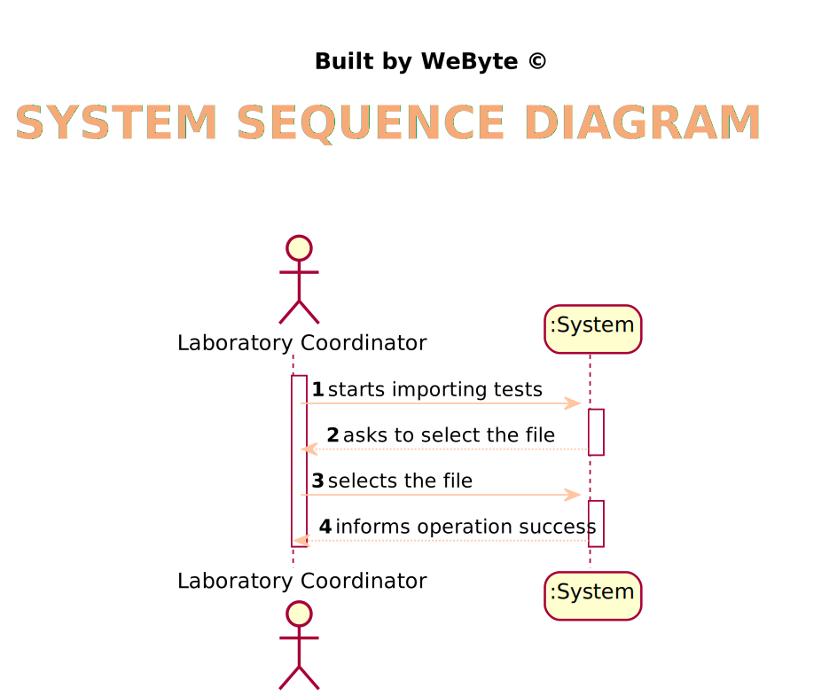

# US 17 - Import clinical tests from a CSV file.

## 1. Requirements Engineering

### 1.1. User Story Description

*As a laboratory coordinator, I want to import clinical tests from a CSV file.*

### 1.2. Customer Specifications and Clarifications

From the Specifications Document:

From the client clarifications:

* > --  Question: When loading a .csv file after another .csv has been loaded beforehand, do we keep the tests that were loaded previously or do we replace them with the new tests being loaded from the new .csv?

* > --  Answer: The tests should not be deleted after being loaded.

* > --  Question: when importing a test and associating it to the client, should the client exist beforehand or should we import the client with the information given on the CSV file?

* > --  Answer: Different from what I asked for the other entities (like the lab), when importing the CSV data, if the client does not exist in the system, then the client should be created using the data available in the CSV file.

* > --  Question: Previously you said that “we can have more categories and parameters for each type of test.” regarding the format of the .csv files. Then, my understanding is that between the TestType and Test_Reg_DateHour columns, the number of columns is dynamic, correct? Could we end up seeing a Category_3, a Category_4, and so on?

* > --  Answer: Yes.
  
* > --  Question:  On the same issue, if there was, let’s say, a Urine type of test, would we also see some of its own categories and parameters reflected on the .csv file, as we see, for instance, N/A COVID categories on .csv files with only BLOOD type of tests?

* > --  Answer: Yes.

* > --  Question: Up until now, we haven’t had any need to assign an address to a client. Seeing that there is now an Address column, that for us is somewhat left unused, would you advise us to add it as an attribute to the Client entity?

* > --  Answer: Yes. The address should have no more than 90 characters. Please consider the address of the Employee to have the same format that I am suggesting now for the client's address. In the beginning of the project I said that the address of the Employee should have no more than 30 characters but with this size we can not write a normal UK address.

* > --  Question: if a labID on the CSV file isn't found on the system, should we consider it "invalid data"?

* > --  Answer: Yes. To import tests of any laboratory (with a given Lab_ID), it is required that a laboratory having the given Lab_ID exists in the system.
  Therefore, if you want to import data from a given laboratory, you should use the application to create that laboratory in the system. Then you should import the data.
When creating a laboratory in the system, you should use the given Lab_ID (available in the CSV file) and define the other attributes using valid data. In this project, we are NOT going to import data from laboratories (or other entities) to reduce the amount of hours required to develop and deliver a working application to the client.
What I say in this message is valid for the laboratories and for other entities that appear in the CSV files.

* > --  Question: In what folder should the CSV file be when we want to use the application through the console?

* > --  Answer: In this sprint each team should develop a graphical user interface. The file to import can be located in any folder. The user should specify the path of the file.

### 1.3. Acceptance Criteria

* AC1: If the file contains invalid data (e.g., a parameter not defined in the system), that data should not be load into the system. An exception should be thrown
* AC2: If the file contains a client not registered in the system, the client should be created usimg the data from the file.
* AC3: The number of parameters and categories can be different from the files provided as an example.
### 1.4. Found out Dependencies

### 1.5 Input and Output Data

Input Data

* Typed data: (none)
  
* Selected data: test file 
  
* Output Data: (In)Success of the operation

### 1.6. System Sequence Diagram (SSD)

*Insert here a SSD depicting the envisioned Actor-System interactions and throughout which data is inputted and outputted to fulfill the requirement. All interactions must be numbered.*

### 1.7 Other Relevant Remarks

*Use this section to capture other relevant information that is related with this US such as (i) special requirements ; (ii) data and/or technology variations; (iii) how often this US is held.*

## 2. OO Analysis

### 2.1. Relevant Domain Model Excerpt
*In this section, it is suggested to present an excerpt of the domain model that is seen as relevant to fulfill this requirement.*

### 2.2. Other Remarks

*Use this section to capture some aditional notes/remarks that must be taken into consideration into the design activity. In some case, it might be usefull to add other analysis artifacts (e.g. activity or state diagrams).*

## 3. Design - User Story Realization

### 3.1. Rationale

**The rationale grounds on the SSD interactions and the identified input/output data.**

| Interaction ID | Question: Which class is responsible for... | Answer  | Justification (with patterns)  |
|:-------------  |:--------------------- |:------------|:---------------------------- |
| Step 1         | ...interacting with the actor?              | ImportTestsUI         | Pure Fabrication: there is no reason to assign this responsibility to any existing class in the Domain Model. |
|                | ...coordinating the US?                     | ImportTestController  | Controller                                                                                                    |
| Step 2         |                                             |                       |                                                                                                               |
| Step 3         | ...allowing the selection of the file       | ImportTestsUI         | Pure Fabrication: there is no reason to assign this responsibility to any existing class in the Domain Model. |
|         		 |  ... save the new Parameter                 | ParameterStore        |      IE: object created has its own data                        |
|                |  ... instantiating a new parameter?         | ParameterStore        |   Creator    |
|         		 |  ... save the new ParameterCategory         | ParameterCategoryStore|      IE: object created has its own data                        |
|                |  ... instantiating a new parameter?         | ParameterCategoryStore|   Creator    |
| Step 4         | ...informing operation success?             | ImportTestsUI         | IE: is responsible for user interaction                                                                       |

### Systematization ##

According to the taken rationale, the conceptual classes promoted to software classes are:

* Company

* Test

* ParameterCategory

* TestType

* Parameter

Other software classes (i.e. Pure Fabrication) identified:

* ImportTestsUI

* ImportTestController

* ParameterCategoryStore

* ParameterStore

* TestTypeStore

* TestStore

## 3.2. Sequence Diagram (SD)

*In this section, it is suggested to present an UML dynamic view stating the sequence of domain related software objects' interactions that allows to fulfill the requirement.*

## 3.3. Class Diagram (CD)

*In this section, it is suggested to present an UML static view representing the main domain related software classes that are involved in fulfilling the requirement as well as and their relations, attributes and methods.*

# 4. Tests
*In this section, it is suggested to systematize how the tests were designed to allow a correct measurement of requirements fulfilling.*

**_DO NOT COPY ALL DEVELOPED TESTS HERE_**

**Test 1:** Throws an exception with the system cannot find the file specified

    @Test
    public void testGetTestListCSV()
            throws IOException, ClassNotFoundException, IllegalAccessException, InstantiationException, ParseException {
        TestStore testStore = new TestStore();
        exceptionRule.expect(FileNotFoundException.class);
        exceptionRule.expectMessage("File not found :(");
        testStore.getTestListCSV("foo.txt");
    }

*It is also recommended to organize this content by subsections.*

# 5. Construction (Implementation)

*In this section, it is suggested to provide, if necessary, some evidence that the construction/implementation is in accordance with the previously carried out design. Furthermore, it is recommeded to mention/describe the existence of other relevant (e.g. configuration) files and highlight relevant commits.*

*It is also recommended to organize this content by subsections.*

## ImportTestController

    public void getTestList(String filename) throws ParseException, IOException, ClassNotFoundException, InstantiationException, IllegalAccessException {
        testStore.getTestListCSV(filename);
    }

    public List<TestDTO> getTestDTOList(){
        return testMapper.toDTOParam(testStore.getTestList());
    }

    public List<File> getFiles(){
        File diretory = new File("./testStorage");
        return Arrays.asList(diretory.listFiles());
    }

## TestStore

    public void getTestListCSV(String fileName) throws ParseException, IOException, ClassNotFoundException, InstantiationException, IllegalAccessException {
        String path = "./testStorage/" + fileName;
        File file = new File(path);
        String line;
        int counter = 0;
        try {
            Scanner read = new Scanner(file);
            String firstLine = read.nextLine();
            String[] firstLineArray = firstLine.split(";");
            createCategories(firstLineArray, file);
            createParameters(firstLineArray, file);
            System.out.println("\n******************************\nLoading: ");
            while (read.hasNext()) {
                line = read.nextLine();
                try {
                    ConsultTestsController consultTestsController = new ConsultTestsController();
                    try {
                        consultTestsController.getClientByTin((line.split(";")[5]));
                    }catch (Exception e){
                        createClient(line);
                    }
                    createTest(firstLine, line);
                    counter++;
                }catch (Exception e){
                    System.out.println("\r" + e.getMessage());
                }
                System.out.print("\rTotal tests imported: " + counter);
            }
        } catch (FileNotFoundException e) {
            System.out.println("File not found :(");
        }
    }

    private void createCategories(String[] array, File file) throws FileNotFoundException {
        Scanner read = new Scanner(file);
        String line = "";
        read.nextLine();
        for (int i = 0; i < array.length; i++) {
            if (array[i].contains("Category")) {
                Scanner scanner = new Scanner(file);
                scanner.nextLine();
                while (scanner.hasNextLine()) {
                    line = scanner.nextLine();
                    if (!parameterCategoryStore.getParameterCategoryList().contains(parameterCategoryStore.getParameterCategoryByDescription(line.split(";")[i])) && !line.split(";")[i].equals("NA")) {
                        parameterCategoryStore.saveParameterCategory(parameterCategoryStore.createParametercategory(parameterCategoryStore.createParameterCategoryCode(line.split(";")[i]), line.split(";")[i]));
                        break;
                    }
                }
            }
        }
    }

    private void createParameters(String[] array, File file) throws FileNotFoundException {
        int j = 0;
        String line;
        Scanner read = new Scanner(file);
        ParameterCategory parameterCategory = null;
        Boolean control = false;
        read.nextLine();
        for (int i = 0; i < array.length; i++) {
            if (array[i].equals("Category")) {
                Scanner scanner = new Scanner(file);
                scanner.nextLine();
                while (scanner.hasNextLine()) {
                    line = scanner.nextLine();
                    if (!line.split(";")[i].equals("NA")) {
                        parameterCategory = parameterCategoryStore.getParameterCategoryByDescription(line.split(";")[i]);
                        control = true;
                        break;
                    }
                    else {
                        control = false;
                    }
                }
                j = i + 1;
                if (control == true) {
                    while (!array[j].equals("Category") && !array[j].equals("Test_Reg_DateHour")) {
                        Parameter p = parameterStore.createParameter(array[j], array[j], array[j], parameterCategory);
                        parameterStore.saveParameter(p);
                        j++;
                    }
                }
            }
        }
    }

# 6. Integration and Demo

*In this section, it is suggested to describe the efforts made to integrate this functionality with the other features of the system.*

This user story is related to the functionality of creating employees, since  it is necessary that the Laboratory Coordinator employee is registered in the system.
In addition, for the tests to be imported, it is necessary to create categories, tests, parameters, so it depends on those features as well.
# 7. Observations

*In this section, it is suggested to present a critical perspective on the developed work, pointing, for example, to other alternatives and or future related work.*

