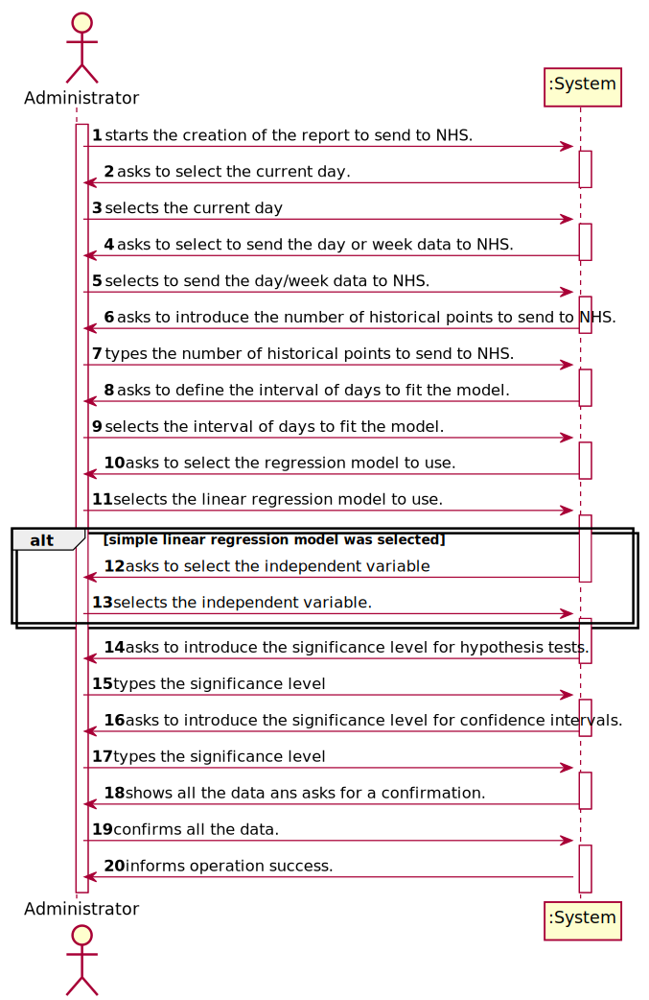

# US 18 - Send the Covid-19 report to the NHS at any time.

## 1. Requirements Engineering

### 1.1. User Story Description

* As an Administrator I want to send the Covid-19 report to the NHS at any time. I want to define the interval of dates to fit the regression model, the number of historical points (number of days or number of weeks) that must be sent to the NHS, the regression model to use and select the independent variables to use. *

### 1.2. Customer Specifications and Clarifications

From the Specifications Document:

From the client clarifications:
    
>  **Q**: <cite> Should the number of historical points have the same range as the date interval defined by the administrator?  
> **A** : <cite> No. The points within the interval are used to fit the linear regression model. The number of historical points are the points for which we want to send the estimates/expect values to NHS. The points within the interval and historical points can overlap. Please carefully review the report example file available in moodle.

> **Q**: If on a certain day or week there aren't any Covid 19 tests realized and therefore no clients, should we consider the mean age to be 0?  
> **A**: Yes, you should consider the mean age to be zero. Sundays should not be considered in your analysis.  

> **Q**:Also, should we ask for the prevision interval level or should we just use 95% like it's shown in the example report?
> **A**: The user should introduce the confidence level value.

> **Q**: Should the reports sent to the NHS be saved in the app, or are they just sent?
> **A**: There is no need to save the report in the app.

> **Q**: <cite> From the report example we got that the administrator defines the dates interval to fit the model. Which date should the application use to provide the report? Is it the registration date or results registration date?  
> **A**: <cite> The registration date should be considered. But only tests that have already been validated should be considered.

> **Q**: <cite> n US18 you said " ..the number of historical points (number of days or number of weeks) that must be sent to the NHS .." what exactly is this ? Is this a interval of dates ?  
> **A**: <cite> Yes, you must allow the client to choose days of weeks.

> **Q**: <cite> From the project description it is known "send the forecasts for these same time horizons (the number of Covid-19 cases for the following day, next week and next month)." In the example report we have in moodle, there is a line that says "// Prediction values". Does this mean that after this line we should put our predictions or it refers to the following table?  
> **A**: <cite> Yes, the prediction values are the ones available in the table that we include in the example.

> **Q**: <cite> Regarding US18 and US19, it is only one report containing all the tests performed by Many Labs to be sent each time, correct? Or is it one report per laboratory, for example? Or other option?  
  **A**: <cite> The report should contain all the tests made by Many Labs.

>**Q**: <cite> Should the report contain the data of all the tests with results (with or without report, with or without validation) or contain only the validated tests? (Or other option?)  
> **A**: <cite> The NHS Covid report should include statistics computed only from validated tests.

> **Q**: <cite> General doubt: Are we going to be able to use more math libraries in order to facilitate the calculus (for example, for confidence intervals) or is the rest of the calculus to be developed by each team?   
> **A**: <cite> Each team should implement the classes and methods needed.

> **Q:**: <cite> which significance level should we use for the hypothesis tests?   
> **A**: <cite> The application should allow the user to choose the significance level.

> **Q**: <cite> from Sprint D requirements we get "I want to define... the number of historical points (number of days or number of weeks) that must be sent to the NHS".
Is the Administrator who must choose between days or weeks? If so, how should he make this choice?  
> **A**: <cite> Yes. The Administrator should select between days and weeks using the user interface.
### 1.3. Acceptance Criteria

* AC1: Only tests that have already been validated should be used.
* AC2: The application should allow the user to choose the significance level for confidence intervals and for hypothesis testing.
* AC3: The system should allow the Administrator to select between a simple linear and multilinear regression model to fit the data. Moreover, the Administrator should be able to choose the independent variable to
  use with the simple linear regression model (either the number of tests realized or the mean age). The system should send the report using the NHS API (available in moodle).
  
* AC4: The report should contain all the tests made by Many Labs laboratories.
* AC5: the interval of days/weeks that is used to create the regression must be greater than 4 days/weeks.
* AC6: If the user chooses to send data for weeks, the dates entered that define the interval for creating the regression model must be Sundays.
* AC7: Sunday data are not used for the linear regression, because on Sundays the lab does not perform tests.
* AC8: There must be tests and the respective users registered in the system.
* AC9: The levels of significance and the number of points to send cannot be empty
### 1.4. Found out Dependencies

*There is a dependency to "US17 -  import clinical tests from a CSV file" since  the report has to contain the data of all tests in the validated state of all many labs laboratories*

### 1.5 Input and Output Data

Input Data

* Typed data:  
  * number of historical points that should be sent to NHS.
  * significance level for hypothesis tests
  * significance level for Confidence intervals.
* Selected data:  
  * Dates interval to fit the model
  * To send the day or week data to NHS.
  * The current day
  * The type of linear regression model.  
  * The independent variables(s)
* Output Data: (In)Success of the operation

### 1.6. System Sequence Diagram (SSD)

*Insert here a SSD depicting the envisioned Actor-System interactions and throughout which data is inputted and outputted to fulfill the requirement. All interactions must be numbered.*

### 1.7 Other Relevant Remarks

*Use this section to capture other relevant information that is related with this US such as (i) special requirements ; (ii) data and/or technology variations; (iii) how often this US is held.*

## 2. OO Analysis

### 2.1. Relevant Domain Model Excerpt
*In this section, it is suggested to present an excerpt of the domain model that is seen as relevant to fulfill this requirement.*

### 2.2. Other Remarks

*Use this section to capture some aditional notes/remarks that must be taken into consideration into the design activity. In some case, it might be usefull to add other analysis artifacts (e.g. activity or state diagrams).*

## 3. Design - User Story Realization

### 3.1. Rationale

**The rationale grounds on the SSD interactions and the identified input/output data.**

| Interaction ID | Question: Which class is responsible for... | Answer  | Justification (with patterns)  |
|:-------------  |:--------------------- |:------------|:---------------------------- |
| Step 1         | ...interacting with the actor?              | SendReportUI         | Pure Fabrication: there is no reason to assign this responsibility to any existing class in the Domain Model. |
|                | ...coordinating the US?                     | SendReportController | Controller                                                                                                    |
| Step 2         |                                             |                        |                                                                                                               |
| Step 3         | ...allowing the selection of the current day?      | SendReportUI         | Pure Fabrication: there is no reason to assign this responsibility to any existing class in the Domain Model. |
| Step 4         |                                             |                        |                                                                                                               |
| Step 3         | ...allowing the selection of "type" of data to send to NHS (day or week data)?  | SendReportUI         | Pure Fabrication: there is no reason to assign this responsibility to any existing class in the Domain Model. |
| Step 6         |                                             |                        |                                                                                                               |
| Step 7         | ...allowing the typing of the number of historical points to send?       | SendReportUI         | Pure Fabrication: there is no reason to assign this responsibility to any existing class in the Domain Model. |
| Step 8         ||
| Step 9        |                                             |                        |                                                                                                               |
| Step 10         | ..allowing the selection of the regression model to use?             | SendReportUI         | IE: is responsible for user interaction                                                                       |
| Step 11       |                                             |                        |                                                                                                               |
| Step 12         | ..allowing the selection of the independent variable?            | SendReportUI         | IE: is responsible for user interaction                                                                       |
| Step 13       |                                             |                        |                                                                                                               |
| Step 14         | ..allowing the typing of the significance level for hypothesis tests?           | SendReportUI         | IE: is responsible for user interaction                                                                       |
| Step 15       |                                             |                        |                                                                                                               |
| Step 16         | ..allowing the typing of the significance level for confidence intervals?           | SendReportUI         | IE: is responsible for user interaction                                                                       |
| Step 17       |                                             |                        |                                                                                                               |
| Step 16         | ..showing all data?           | SendReportUI         | IE: is responsible for user interaction                                                                       |
| Step 18       |                                             |                        |                                                                                                               |
| Step 19       |  ...transport the data between UI and domain? | NHSReportDTO                      |  Pure Fabrication: there is no reason to assign this responsibility to any existing class in the Domain Model.                                                                                                             |
|               |  ...send the report to NHS?                               |  NHSApiExternalModule                      |   Pure Fabrication: there is no reason to assign this responsibility to any existing class in the Domain Model.                                                                                                            |
|               |  ...create the regression?                           |  MultipleLinearRegression and LinearRegression                   |   Pure Fabrication: there is no reason to assign this responsibility to any existing class in the Domain Model.                                                                                                            |
|               | ... transport the data needed to create the report?  | NHSReportValuesDTO | Pure Fabrication: there is no reason to assign this responsibility to any existing class in the Domain Model. |
|               | ... creates the NHSReportDTO?                        | NhsReportMapper | Pure Fabrication: there is no reason to assign this responsibility to any existing class in the Domain Model.|
|               | ... creates the NHSReportValuesDTO                   | NHSReportValuesMapper | Pure Fabrication: there is no reason to assign this responsibility to any existing class in the Domain Model.  | 
|               | ... creates the report?                              | NHSReport             | IE: the class has its own data
| Step 20 | | | |
### Systematization ##

According to the taken rationale, the conceptual classes promoted to software classes are:

* NHSReport

Other software classes (i.e. Pure Fabrication) identified:

* MultipleLinearRegression  
* LinearRegression  
* NHSReportValuesDTO  
* NHSReportValuesMapper  
* NhsReportMapper  
* NHSReportValuesMapper  
* NHSApiExternalModule  
* SendReportUI  
* SendReportController  

## 3.2. Sequence Diagram (SD)

*In this section, it is suggested to present an UML dynamic view stating the sequence of domain related software objects' interactions that allows to fulfill the requirement.*

## 3.3. Class Diagram (CD)

*In this section, it is suggested to present an UML static view representing the main domain related software classes that are involved in fulfilling the requirement as well as and their relations, attributes and methods.*

# 4. Tests
*In this section, it is suggested to systematize how the tests were designed to allow a correct measurement of requirements fulfilling.*

**_DO NOT COPY ALL DEVELOPED TESTS HERE_**

# 5. Construction (Implementation)

*In this section, it is suggested to provide, if necessary, some evidence that the construction/implementation is in accordance with the previously carried out design. Furthermore, it is recommeded to mention/describe the existence of other relevant (e.g. configuration) files and highlight relevant commits.*

## SendReportNhsController

    public class SendReportNhsController {
    private final TestStore testStore;

    /**
     * Constructor
     */
    public SendReportNhsController() {
        testStore = App.getInstance().getCompany().getTestStore();
    }

    /**
     * Generates the report to send to NHS.
     * @param nhsReportDTO dto with all information to generate the report.
     * @throws ParseException
     * @throws IOException
     * @throws ClassNotFoundException
     * @throws InstantiationException
     * @throws IllegalAccessException
     */
    public void generateReport(NhsReportDTO nhsReportDTO) throws ParseException, IOException, ClassNotFoundException, InstantiationException, IllegalAccessException {
        checkIfTestsAdClientsAreISystem();

        //get the NHS Api
        NHSReportValuesMapper mapper = new NHSReportValuesMapper();
        Properties properties = new Properties();
        InputStream in = new FileInputStream("configuration.conf");
        properties.load(in);
        String api = properties.getProperty("Company.API.SendNHS.Class");
        Class<?> nhsAPI = Class.forName(api);
        ReportNHS reportNHS = (ReportNHS) nhsAPI.newInstance();

        //sets the data and creates the linear regression
        Date lowerLimit = nhsReportDTO.getIntervalOfDaysToFitTheModel()[0];
        Date upperLimit = nhsReportDTO.getIntervalOfDaysToFitTheModel()[1];
        List<Test> testsMadeInInterval = testStore.getCovidTestsForRegression(lowerLimit, upperLimit);
        double[] Y = testStore.getYList(lowerLimit, upperLimit, testsMadeInInterval);

        NHSReportValuesDTO nhsReportValuesDTO;
        String table = "";
        Regression regression;
        if (nhsReportDTO.getModelToUse().equals("multiple")) {
            List<double[]> x = new ArrayList<>();
            if (nhsReportDTO.getDaysOrWeeks().equals("days")) {
                x.add(testStore.getXlistNumberTestPerDay(lowerLimit, upperLimit, testsMadeInInterval));
                x.add(testStore.getXListAges(lowerLimit, upperLimit));
                regression = new MultipleLinearRegression(x, Y);

            } else {
                x.add(testStore.getXListNumberTestsByWeek(lowerLimit, upperLimit, testStore.getTestList()));
                x.add(testStore.getXListAgesByWeek(lowerLimit, upperLimit));
                Y = testStore.getYListWeek(lowerLimit, upperLimit);
                regression = new MultipleLinearRegression(x, Y);
            }
            table = testStore.getTableWithHistoricalDataToSendNHS(regression, nhsReportDTO);
        } else {
            if (nhsReportDTO.getDaysOrWeeks().equals("days")) {
                double[] x;
                if (nhsReportDTO.getIndependentVars()[0].equals("tests/day")) {
                    System.out.println("tests/day");
                    x = testStore.getXlistNumberTestPerDay(lowerLimit, upperLimit, testsMadeInInterval);
                } else {
                    System.out.println("meanAge");
                    x = testStore.getXListAges(lowerLimit, upperLimit);

                }
                regression = new LinearRegression(x, Y);
            } else {
                Y = testStore.getYListWeek(lowerLimit, upperLimit);

                double[] x;
                if (nhsReportDTO.getIndependentVars()[0].equals("tests/day")) {
                    System.out.println("tests/day");
                    x = testStore.getXListNumberTestsByWeek(lowerLimit, upperLimit, testsMadeInInterval);
                } else {
                    System.out.println("meanAge");
                    x = testStore.getXListAgesByWeek(lowerLimit, upperLimit);

                }
                regression = new LinearRegression(x, Y);
            }
            table = testStore.getTableWithHistoricalDataToSendNHS(regression, nhsReportDTO);

        }

        //creates the DTO with all the needed data to create the report
        nhsReportValuesDTO = mapper.toDTO(nhsReportDTO, regression, table);

        //creates and send the report
        NHSReport nhsReport = new NHSReport();
        String report = nhsReport.generateReportString(nhsReportValuesDTO);
        reportNHS.SendReport(report);

        //NHSReport report = new NHSReport();
        //report.generateReport(nhsReportDTO);
    }

    /**
     * Checks if the system has tests and clients.
     */
    private void checkIfTestsAdClientsAreISystem(){
        if(testStore.getTestList().size() == 0){
            throw new NullPointerException("There is no test registered in the system.");
        }
        if(App.getInstance().getCompany().getClientStore().getClients().size() == 0){
            throw new NullPointerException("There is no client in the system.");
        }
    }

    }

# 6. Integration and Demo

*In this section, it is suggested to describe the efforts made to integrate this functionality with the other features of the system.*

# 7. Observations

*In this section, it is suggested to present a critical perspective on the developed work, pointing, for example, to other alternatives and or future related work.*

