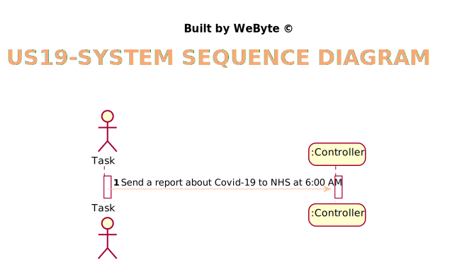

# US 19 - Send to the NHS daily reports of Covid-19 data.

## 1. Requirements Engineering

### 1.1. User Story Description

*The Many Labs company wants to send to the NHS daily reports of Covid-19
data, including the number of observed values and estimated values. Reports should be
generated automatically with historical data and must be sent every day at 6:00 am.*

### 1.2. Customer Specifications and Clarifications

From the Specifications Document:
* "Considering that Many Labs has the exclusivity to perform Covid-19 tests, and that the contract
  with the NHS in England requires Many Labs to summarize and report Covid-19 data, the company
  needs to: identify the number of Covid-19 tests performed, identify all positive results to Covid-19
  tests, report the total number of Covid-19 cases per day, per week and per month of the year, and
  send the forecasts for these same time horizons (the number of Covid-19 cases for the following
  day, next week and next month).The company is also required to generate daily (automatic) reports
  with all the information demanded by the NHS and should send them to the NHS using their API.
  To make the predictions, the NHS contract defines that a linear regression algorithm should be used.
  The NHS required that both simple linear and multiple linear regression algorithms should be
  evaluated to select the best model."

From the client clarifications:
>  **Q**: <cite> Should the number of historical points have the same range as the date interval defined by the administrator?  
> **A** : <cite> No. The points within the interval are used to fit the linear regression model. The number of historical points are the points for which we want to send the estimates/expect values to NHS. The points within the interval and historical points can overlap. Please carefully review the report example file available in moodle.

> **Q**: <cite> From the report example we got that the administrator defines the dates interval to fit the model. Which date should the application use to provide the report? Is it the registration date or results registration date?  
> **A**: <cite> The registration date should be considered. But only tests that have already been validated should be considered.

> **Q**: <cite> From the project description it is known "send the forecasts for these same time horizons (the number of Covid-19 cases for the following day, next week and next month)." In the example report we have in moodle, there is a line that says "// Prediction values". Does this mean that after this line we should put our predictions or it refers to the following table?  
> **A**: <cite> Yes, the prediction values are the ones available in the table that we include in the example.

> **Q**: <cite> Regarding US18 and US19, it is only one report containing all the tests performed by Many Labs to be sent each time, correct? Or is it one report per laboratory, for example? Or other option?  
**A**: <cite> The report should contain all the tests made by Many Labs.

>**Q**: <cite> Should the report contain the data of all the tests with results (with or without report, with or without validation) or contain only the validated tests? (Or other option?)  
> **A**: <cite> The NHS Covid report should include statistics computed only from validated tests.

> **Q**: <cite> General doubt: Are we going to be able to use more math libraries in order to facilitate the calculus (for example, for confidence intervals) or is the rest of the calculus to be developed by each team?   
> **A**: <cite> Each team should implement the classes and methods needed.

> **Q:**: <cite> which significance level should we use for the hypothesis tests?   
> **A**: <cite> The application should allow the user to choose the significance level.

> **Q**: <cite> from Sprint D requirements we get "I want to define... the number of historical points (number of days or number of weeks) that must be sent to the NHS".
Is the Administrator who must choose between days or weeks? If so, how should he make this choice?  
> **A**: <cite> Yes. The Administrator should select between days and weeks using the user interface.

### 1.3. Acceptance Criteria

* AC1: The report should include day and week (observed and estimated) values.
* AC2: Simple linear and multilinear regression models can be used to compute the estimates and corresponding confidence intervals.
* AC3: The performance of each model should be used to select the best model.
* AC4: The best model will be used to make the estimated/expected values that will be send to NHS.
* AC5: The interval of dates to fit the regression model and the number of historical points (number of days and number of weeks) must be defined through a configuration file.
* AC6: The system should send the report using the NHS API (available in moodle).

### 1.4. Found out Dependencies

* Found out dependency to US18 "send the Covid-19 report to the NHS at any time", since it is required to send reports at a time.

### 1.5 Input and Output Data
Input Data

* Typed data:
  * number of historical points that should be sent to NHS.

* Selected data:
  * Dates interval to fit the model

  * To send the day or week data to NHS.
  * The current day
  * The tye of linear regression model.
  * The independent variables(s)
* Output Data: (In)Success of the operation

### 1.6. System Sequence Diagram (SSD)

### 1.7 Other Relevant Remarks

*No other relevant remarks*

## 2. OO Analysis

### 2.1. Relevant Domain Model Excerpt

### 2.2. Other Remarks

*No other relevant remarks*

## 3. Design - User Story Realization

### 3.1. Rationale
**The rationale grounds on the SSD interactions and the identified input/output data.**

| Interaction ID | Question: Which class is responsible for... | Answer  | Justification (with patterns)  |
|:-------------  |:--------------------- |:------------|:---------------------------- |
| Step 1         | ...interacting with the actor?              | SendReportUI         | Pure Fabrication: there is no reason to assign this responsibility to any existing class in the Domain Model. |
|                |                                                                                              |
| Step 2         |                                             |                        |                                                                                                               |
| Step 3         | ...allowing the selection of the current day?      | SendReportUI         | Pure Fabrication: there is no reason to assign this responsibility to any existing class in the Domain Model. |
| Step 4         |                                             |                        |                                                                                                               |
| Step 3         | ...allowing the selection of "type" of data to send to NHS (day or week data)?  | SendReportUI         | Pure Fabrication: there is no reason to assign this responsibility to any existing class in the Domain Model. |
| Step 5         |                                             |                        |                                                                                                               |
| Step 6         | ...allowing the typing of the number of historical points to send?       | SendReportUI         | Pure Fabrication: there is no reason to assign this responsibility to any existing class in the Domain Model. |
| Step 7         ||
| Step 8        |                                             |                        |                                                                                                               |
| Step 9         | ..allowing the selection of the regression model to use?             | SendReportUI         | IE: is responsible for user interaction                                                                       |
| Step 10       |                                             |                        |                                                                                                               |
| Step 11         | ..allowing the selection of the independent variable?            | SendReportUI         | IE: is responsible for user interaction                                                                       |
| Step 12       |                                             |                        |                                                                                                               |
| Step 13         | ..allowing the typing of the significance level for hypothesis tests?           | SendReportUI         | IE: is responsible for user interaction                                                                       |
| Step 14       |                                             |                        |                                                                                                               |
| Step 15         | ..allowing the typing of the significance level for confidence intervals?           | SendReportUI         | IE: is responsible for user interaction                                                                       |
| Step 16       |                                             |                        |                                                                                                               |
| Step 17         | ..showing all data?           | SendReportUI         | IE: is responsible for user interaction                                                                       |

### Systematization ##

According to the taken rationale, the conceptual classes promoted to software classes are:

* SendReportUI

Other software classes (i.e. Pure Fabrication) identified:

* SendReportUI

## 3.2. Sequence Diagram (SD)

*In this section, it is suggested to present an UML dynamic view stating the sequence of domain related software objects' interactions that allows to fulfill the requirement.*

## 3.3. Class Diagram (CD)

*In this section, it is suggested to present an UML static view representing the main domain related software classes that are involved in fulfilling the requirement as well as and their relations, attributes and methods.*

# 4. Tests
*In this section, it is suggested to systematize how the tests were designed to allow a correct measurement of requirements fulfilling.*

**_DO NOT COPY ALL DEVELOPED TESTS HERE_**

# 5. Construction (Implementation)

*In this section, it is suggested to provide, if necessary, some evidence that the construction/implementation is in accordance with the previously carried out design. Furthermore, it is recommeded to mention/describe the existence of other relevant (e.g. configuration) files and highlight relevant commits.*

*It is also recommended to organize this content by subsections.*

## ValidateTestController

## ValidateTestUI

# 6. Integration and Demo

*In this section, it is suggested to describe the efforts made to integrate this functionality with the other features of the system.*

This user story is related to many user stories, since first of all it is necessary that the Laboratory Coordinator employee is registered in the system, it is also necessary that all the other employees work, so that in the end a test can be validated, thus putting an end to its life cycle.

# 7. Observations

*In this section, it is suggested to present a critical perspective on the developed work, pointing, for example, to other alternatives and or future related work.*

