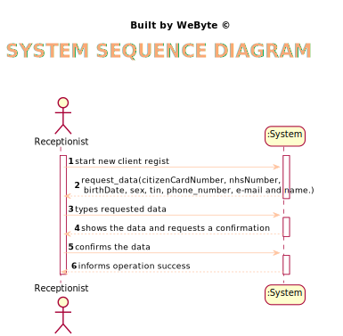
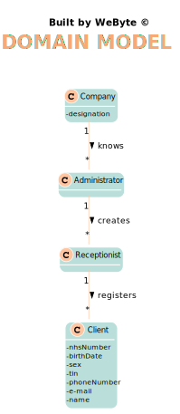
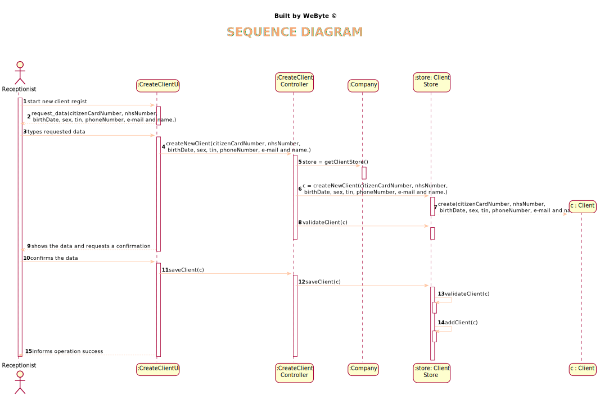
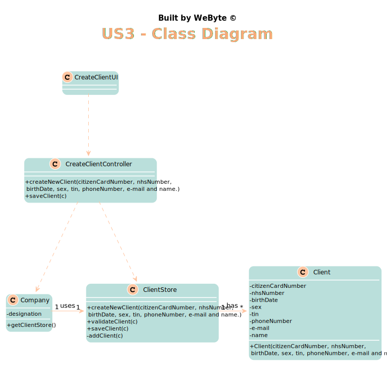

# US 3 - Register a client.

## 1. Requirements Engineering

### 1.1. User Story Description

*As a receptionist of the laboratory, I want to register a client*

### 1.2. Customer Specifications and Clarifications

From the Specifications Document:
* >"In case of a new client, the receptionist registers the client in the application. To register a client, the
  receptionist needs the client’s citizen card number, National Healthcare Service (NHS) number,
  birth date, sex, Tax Identification number (TIF), phone number, e-mail and name."
* From the client clarifications:
* > Question: Does the receptionist need to be logged in the app to preform the regist?
* > Answer: Yes.
* > Question: What parameter (asked by the receptionist) should the system use to create the password of the new client?
* > Answer: The password should be randomly generated. It should have ten alphanumeric characters.
* > Question: How should the system send a email to the client with the password?
* > Answer: Considering a set of technical restrictions, during the development of the Integrative Project we will not use any e-mail or SMS API services to send messages. All the e-mail and SMS messages should be written to a file with the name emailAndSMSMessages.txt. This file simulates the use of e-mail and SMS API services.
* > Question: Does the client need to tell his age to the recepcionis. Im asking because before you didnt especified that that would be a parameter?
* > Answer: No, only needs to tell the birth day (from a previous post). The application must validate and should not accept clients who have more than 150 years of age.
It is good to have old people using our services, but 150 years it's too much and it may be a typo.
* > Question: Do clients have to change their password after registration? (first login)
* > Answer: No.
* > Question: Can they change their password whenever they want?
* > Answer: No. For now, there are no user story or use case to update the password.
* > Question: What are exactly the optional attributes when creating a client? In a previous post you've stated that it was only the phone number, and in another that it was only the sex.
* > Answer: The sex is optional. All other fields are required.
* > Question: Also, does the phone number has to be validated as a valid phone number? And can it be registered with a prefix (+44) or just the number?
* > Answer: This lab only operates in England, there is no need to use the prefix.
  
### 1.3. Acceptance Criteria

* AC1: Citizen Card - 16 digit number
* AC2: NHS - 10 digit number
* AC3: TIN - 10 digit number
* AC4: Birth day - in which format? - DD/MM/YY
* AC5: Sex - should only be Male/Female or include more options. - Male/Female - but it's optional
* AC6: Phone number: which length/format? - 11 digit number
* AC7: Name - max length = 35 characters
* AC8: The same customer cannot be registered twice

### 1.4. Found out Dependencies

*US7*

### 1.5 Input and Output Data

Input Data
* Typed data: Citizen Card, NHS, TIN, Birth day, Sex, Phone number
* Selected data:
  Output Data
* (In)Success of the operation

### 1.6. System Sequence Diagram (SSD)

*Insert here a SSD depicting the envisioned Actor-System interactions and throughout which data is inputted and outputted to fulfill the requirement. All interactions must be numbered.*

### 1.7 Other Relevant Remarks

*Use this section to capture other relevant information that is related with this US such as (i) special requirements ; (ii) data and/or technology variations; (iii) how often this US is held.*

## 2. OO Analysis

### 2.1. Relevant Domain Model Excerpt
*In this section, it is suggested to present an excerpt of the domain model that is seen as relevant to fulfill this requirement.*

### 2.2. Other Remarks

*Use this section to capture some aditional notes/remarks that must be taken into consideration into the design activity. In some case, it might be usefull to add other analysis artifacts (e.g. activity or state diagrams).*

## 3. Design - User Story Realization

### 3.1. Rationale

**The rationale grounds on the SSD interactions and the identified input/output data.**

| Interaction ID | Question: Which class is responsible for... | Answer  | Justification (with patterns)  |
|:-------------  |:--------------------- |:------------|:---------------------------- |
|Step 1 		 |	... interacting with the actor? | CreateClientUI   |  Pure Fabrication: there is no reason to assign this responsibility to any existing class in the Domain Model.
|                |  ... coordinating the US? |       CreateClientController      |   Controller          
|Step 2
| Step 3 		 |  ... save new data     |    ClientStore         |      IE: object created has its own data                        |
|                |  ... instantiating a new client |       ClientStore      |   Creator    |
| Step 4  		 |							 |             |                              |              
| Step 5  		 |	... validating all data (local validation)?	         |   Client   |    IE: owns its data.                          |              
|  		         |	... validating all data (global validation)?         |   ClientStore  |  IE: knows all clients                             |              
|  		         |	... saving the created client?						 |   ClientStore          |   IE: stores all clients                          |              
| Step 6  		 |		... informing operation success?					 |     CreateClientUI        |   IE: is responsible for user interaction                           |

### Systematization ##

According to the taken rationale, the conceptual classes promoted to software classes are:

* Client

Other software classes (i.e. Pure Fabrication) identified:
* CreateClientUI
* CreateClientController
* ClientStore

## 3.2. Sequence Diagram (SD)

*In this section, it is suggested to present an UML dynamic view stating the sequence of domain related software objects' interactions that allows to fulfill the requirement.*

## 3.3. Class Diagram (CD)

*In this section, it is suggested to present an UML static view representing the main domain related software classes that are involved in fulfilling the requirement as well as and their relations, attributes and methods.*

# 4. Tests
*In this section, it is suggested to systematize how the tests were designed to allow a correct measurement of requirements fulfilling.*

**_DO NOT COPY ALL DEVELOPED TESTS HERE_**

**Test 1:** Checks that only a citizen card number with a valid length (16 digits) can be entered

	@Test
    public void checkCitizenNumberBig() {
        exceptionRule.expect(IllegalArgumentException.class);
        exceptionRule.expectMessage("Invalid Citizen Card Number, it must contain 16 digits");
        cli.checkCitizenCardNumber("12345678193391331313131311431");
    }

**Test 2:** Checks that a client cannot be created with empty email.

    @Test
    public void checkEmailEmpty() {
        exceptionRule.expect(IllegalArgumentException.class);
        exceptionRule.expectMessage("Invalid Email");
        cli.checkEmail("");
    }

**Test 3:** Checks that a client is created correctly.

    @Test
    public void createNewClient() throws ParseException {
        SimpleDateFormat df = new SimpleDateFormat("dd-MM-yyyy");
        Date date = df.parse("23-12-1998");
        Client client = new Client("1234567890123456",1234567890, 1234567891,  date, "Male", "12345678910", "Miguel","miguel@ipp.pt");
    }

**Test 4:** Checks that it is not possible to register two customers with exactly the same data.

    @Test
    public void validateClientDifferent() throws ParseException {
        SimpleDateFormat df = new SimpleDateFormat("dd-MM-yyyy");
        Date date = df.parse("23-12-1998");
        exceptionRule.expect(IllegalArgumentException.class);
        exceptionRule.expectMessage("Client " + cli.getName() + " already exists");
        Client cli2 = new Client("1234567890123452",1234567860, 1234547891,  date, "Male", "12345678901", "Pedro","pedro@ipp.pt");
        ClientStore clientStore = new ClientStore();
        clientStore.add(cli);
        clientStore.validateClient(cli2);
    }

*It is also recommended to organize this content by subsections.*

# 5. Construction (Implementation)

*In this section, it is suggested to provide, if necessary, some evidence that the construction/implementation is in accordance with the previously carried out design. Furthermore, it is recommeded to mention/describe the existence of other relevant (e.g. configuration) files and highlight relevant commits.*

*It is also recommended to organize this content by subsections.*

##CreateClientController
    public class CreateClientController {
    private Company company;
    private Client c;
    private ClientStore store;

    public CreateClientController() {
        this(App.getInstance().getCompany());
    }

    public CreateClientController(Company company) {
        this.company = company;
        store = company.getClientStore();
        this.c = null;
    }

    public void createNewClient(String citizenCardNumber, int nhsNumber, int tin, Date birth, String sex, String phoneNumber, String name, String email)  {
        c = store.createNewClient(citizenCardNumber, nhsNumber, tin, birth, sex, phoneNumber, name, email);
        store.validateClient(c);

    }

    public boolean add(Client client) {
        return store.add(client);
    }

    public void saveClient() throws IOException {
        String password = generatePassword();
        System.out.println("Password: " + password);
        saveClientLogin(c.getName(), password, c.getEmail());
        AuthFacade PW = company.getAuthFacade();
        PW.addUser(c.getName(), c.getEmail(), password);
        this.store.saveClient(c);
    }

    public List<Client> getClients() {
        return store.getClients();
    }

##ClientStore

    public class ClientStore {
      private List<Client> clientList = new ArrayList<Client>();
  
      public ClientStore() {
      }
  
      public Client createNewClient(String citizenCardNumber, int nhsNumber, int tin, Date birth, String sex, String phoneNumber, String name, String email){
          Client c = new Client(citizenCardNumber, nhsNumber, tin, birth, sex, phoneNumber, name, email);
          return c;
      }
  
      public boolean validateClient(Client c) {
          if (c == null)
              return false;
          int i = 0;
          for (Client client : clientList) {
              if (c.equals(clientList.get(i))) {
                  throw new IllegalArgumentException("Client " + client.getName() + " already exists");
              }
              i++;
          }
          return !this.clientList.contains(c);
      }
      public void saveClient(Client c) {
          validateClient(c);
          add(c);
      }

# 6. Integration and Demo

*In this section, it is suggested to describe the efforts made to integrate this functionality with the other features of the system.*

As in this user story is to create a new customer, and the only person that can do it is the receptionist, this user story is dependent of user story 7 that was to create a new employee. In this case, in the execution of the program, to access the functionalities of this user story it is necessary to create a new receptionist and with the access data to the system, enter as a receptionist and finally register the new customer.

# 7. Observations

*In this section, it is suggested to present a critical perspective on the developed work, pointing, for example, to other alternatives and or future related work.*

- Creating a client involves a lot of parameters, in fact, it is the user story with the most parameters involved and so the use of dtos will probably help a lot in a next sprint.
- The creation of a new client is already quite complete, however it would be good to have functionalities that allow the modification of parameters introduced during the client's creation.

