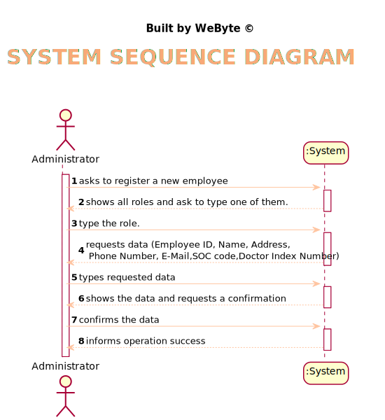
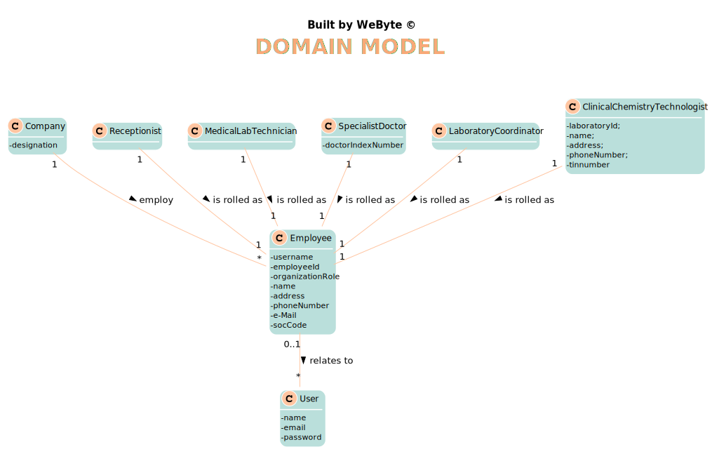
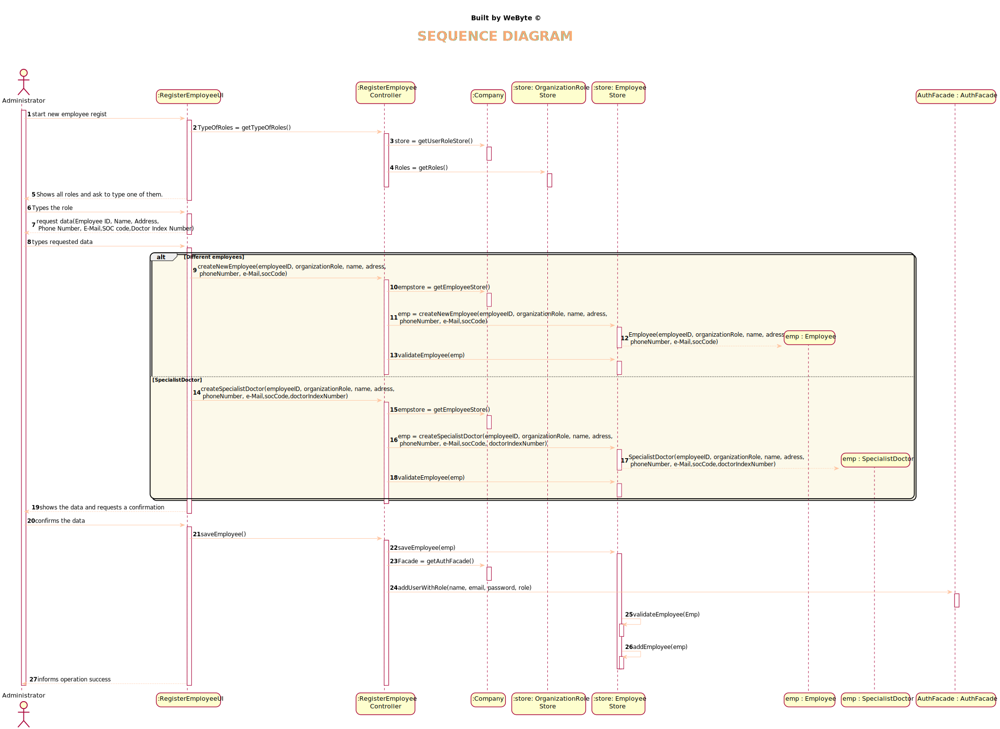
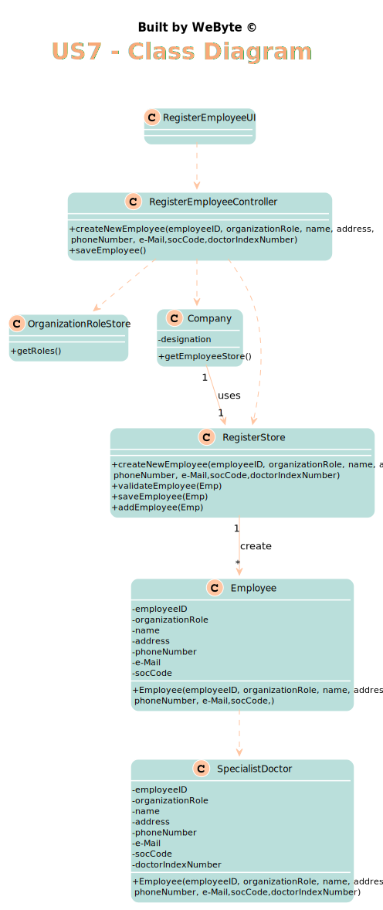

# US 7 - Register a new employee

## 1. Requirements Engineering

### 1.1. User Story Description

*As an administrator, I want to register a new employee.*

### 1.2. Customer Specifications and Clarifications

>**Q:** How should we generate the SOC number , employee ID and the doctor index number ? What type and length they should have ?

>**A:** The employee ID should be generated from the initials of the employee name and should include a number. The number should have 5 digits and it increases automatically when a new employee is registered in the system. For instance, if the company has 20 employees and the administrator wants to register a specialist doctor with the name Ana Maria Santos Moura, then the the employee ID for this specialist doctor should be AMSM00021.*
Regarding the SOC and doctor index number, I already answered this question.

>**Q:** For the role id and respective description should we use any specific format or type?

>**A:** From a previous answer: "All the roles that exist in the Many Labs company are characterized by the following attributes:
Employee ID; Organization Role; Name; Address; Phone Number; E-Mail; Standard Occupational Classification (SOC) code.

> **Q:** When creating a new employee, the attributes "Employee ID" and "Doctor Index Number", are implemented by the administrator or incremented by the system?

> **A:** Only the employee ID should be generated from the initials of the employee name and should include a number. The number has 5 digits and is increases automatically when a new employee is registered in the system. For instance, if the company has 20 employees and wants to register a specialist doctor having the name Ana Maria Santos Moura, then the the employee ID for this specialist doctor should be AMSM00021.
   The Doctor Index Number should be introduced by the administrator.

> **Q:** Also, should we the employees be allocated to the clinical lab in which they work? Or, for example, can one medical lab technician work in more than one clinical analysis lab?

> **A:** Each Receptionist and each Medical Lab Technician can work in any Clinical Analysis Laboratory of the Many Labs network.

> **Q:** how are the passwords delivered to the users (client/employee)?

> **A:** Each users receives an e-mail informing that the registration was successful and that he can start to use the system. The e-mail includes the user password.

> **Q:** The administrator needs to be logged in to execute his role?

> **A:** Yes.
 
> **Q:** Is the administrator an employee? If he/she is, who does him/her register?

> **A:** Yes. An administrator should be registered when the application starts for first time. The application can have more than one administrator.

> **Q:** When the application is delivered , should it have default employees , ex:administrator,etc.. , or should be completly empty (without any user or employee).

> **A:** One Administrator must be registered before starting the application for the first time.

> **Q:** Should we vallidate if a new employee is the same as one that there is already inside the system ? Do we need to vallidate same atributes to check similarities ?

> **A:** Yes. Yes.

> **Q:** Are there any other employee roles than the ones specified in the documents?

> **A:** No.

>**Q:** Can an employee have more than a role?

> **A:** Every user of the application has only one role.

>**Q:** I read in a previous post that " The doctor Index Number is introduced by the administrator " , I searched in Goolge and i understood that is lenght is 6 digits . So i want to know if we need to do any validation .

> **A:** It is always a good practice to validate data introduced by the user. For now, it is not necessary to confirm that the code really exists.

>**Q:** I searched about the SOC number and is lenght is 4 diggits . Having this in mind , i want to know if this number is introduced by the administrator or generated automatically and if there is any validation to d

>-**A:** It is introduced by the administrator.
### 1.3. Acceptance Criteria

*AC1- Employee ID - The number is generated with initials and 5 digits*

*AC2- The same employee cannot be registered twice.*

*AC3- Each user must have a single role defined in the system.*

*AC4- None of the attributes can be blank.*
*AC5- Phone Number - The number has 11 digitss*

*AC6- SOC Code - The number has 4 digits*

*AC7- Doctor Index Number is exclusive for Speacialist Doctor and has 6 digits.
### 1.4. Found out Dependencies

*No Dependencies were found*

### 1.5 Input and Output Data

*Input Data
* Typed data: name, address, phone number, E-Mail,Organization Role, Soc, Doctor Index Number.
  Output Data
* (In)Success of the operation*

### 1.6. System Sequence Diagram (SSD)

*Insert here a SSD depicting the envisioned Actor-System interactions and throughout which data is inputted and outputted to fulfill the requirement. All interactions must be numbered.*

### 1.7 Other Relevant Remarks

## 2. OO Analysis

### 2.1. Relevant Domain Model Excerpt

### 2.2. Other Remarks

*Use this section to capture some aditional notes/remarks that must be taken into consideration into the design activity. In some case, it might be usefull to add other analysis artifacts (e.g. activity or state diagrams).*

## 3. Design - User Story Realization

### 3.1. Rationale

**The rationale grounds on the SSD interactions and the identified input/output data.**

| Interaction ID | Question: Which class is responsible for... | Answer  | Justification (with patterns)  |
|:-------------  |:--------------------- |:------------|:---------------------------- |
|Step 1 		 |	... interacting with the actor? | RegisterEmployeeUI   |  Pure Fabrication: there is no reason to assign this responsibility to any existing class in the Domain Model.
|                |  ... coordinating the US? |       RegisterEmployeeController      |   Controller                           |
|                |  ... knowing the role to show? |       OrganizationRoleStore      |   IE: Organization role are stored in the OrganizationRoleStore.  |
| Step 2  		 |							 |             |                              |
| Step 3  		 |	... allowing the imput of the role |    RegisterEmployeeUI         |    Pure Fabrication: there is no reason to assign this responsibility to any existing class in the Domain Model.         |
| Step 4  		 |							 |             |                              |
| Step 5  		 |  ... save the new Employee Data|    EmployeeStore         |      IE: object created has its own data                        |
|                |  ... instantiating a new Employee? |       EmployeeStore      |   Creator    |
|                |  ... instantiating a new SpecialistDoctor? |       EmployeeStore      |   Creator    |
| Step 6  		 |							 |             |                              |              
| Step 7  		 |	... validating all data (local validation)?	         |   Employee   |    IE: owns its data.                          |              
|   		     |	... validating DoctorIndexNumber (local validation)?	         |  SpecialistDoctor   |    IE: owns its data.                          |              
|  		         |	... validating all data (global validation)?         |   EmployeeStore  |  IE: knows all Employees                             |              
|  		         |	... saving the created Employee?						 |   EmployeeStore          |   IE: stores all Employees                           |              
| Step 8  		 |		... informing operation success?					 |     RegisterEmployeeUI        |   IE: is responsible for user interaction                           |     

### Systematization ##

According to the taken rationale, the conceptual classes promoted to software classes are:

 * Employee
 * SpecialistDoctor

Other software classes (i.e. Pure Fabrication) identified:
 * RegisterEmployeeUI
 * RegisterEmployeeController
 * EmployeeStore
 * OrganizationRoleStore

## 3.2. Sequence Diagram (SD)

*In this section, it is suggested to present an UML dynamic view stating the sequence of domain related software objects' interactions that allows to fulfill the requirement.*

## 3.3. Class Diagram (CD)

*In this section, it is suggested to present an UML static view representing the main domain related software classes that are involved in fulfilling the requirement as well as and their relations, attributes and methods.*

# 4. Tests
*In this section, it is suggested to systematize how the tests were designed to allow a correct measurement of requirements fulfilling.*

**Test 1:** Check that it is not possible to create an instance of the Employee class with empty values.

	@Test
    public void checkNameEmpty() {
        exceptionRule.expect(IllegalArgumentException.class);
        exceptionRule.expectMessage("Name cannot be empty");
        emp.checkName("");

    }
**Test 2:** Check that it is not possible to create an instance of the Employee class with a phone number who does not have 11 chars - AC5.
     
    @Test
    public void checkPhoneNumberSize() {
        exceptionRule.expect(IllegalArgumentException.class);
        exceptionRule.expectMessage("Invalid Phone Number! Must have 11 digits");
        emp.checkPhoneNumber("12345677542242241343");
    }
**Test 3:** Check that it is not possible to create an instance of the same employee- AC2.

    @Test
    public void validateEmployeeDifferent() {
        exceptionRule.expect(IllegalArgumentException.class);
        exceptionRule.expectMessage("Employee " + emp.getName() + " already exists");
        emp = new Employee("Pedro", "RECEPTIONIST", "Rua do Monte", "12345678901", "1234567890@gmail.com", 1234, "P00002");
        Employee emp2 = new Employee("Pedro", "RECEPTIONIST", "Rua do Monte", "12345678901", "1234567890@gmail.com", 1234, "P00002");;
        EmployeeStore employeeStore = new EmployeeStore();
        employeeStore.add(emp);
        employeeStore.validateEmployee(emp2);
    }

**Test 4:** Check an employee created correctly

    @Test
    public void validateEmployeeCorrect(){
    Employee emp2 = new Employee("André", "MEDICAL LAB TECHNICIAN", "Rua Fixe", "12345678902", "1234567890@gmail.com", 1234, "P00002");;
    EmployeeStore employeeStore = new EmployeeStore();
    employeeStore.add(emp);
    employeeStore.validateEmployee(emp2);
}

# 5. Construction (Implementation)

*In this section, it is suggested to provide, if necessary, some evidence that the construction/implementation is in accordance with the previously carried out design. Furthermore, it is recommeded to mention/describe the existence of other relevant (e.g. configuration) files and highlight relevant commits.*

*It is also recommended to organize this content by subsections.*

##RegisterEmployeeController

    public class RegisterEmployeeController {
    private Company company;
    private Employee Emp;
    private EmployeeStore store;
    private OrganizationRoleStore roleList = new OrganizationRoleStore();

    public RegisterEmployeeController() {
        this(App.getInstance().getCompany());

    }

    public RegisterEmployeeController(Company company) {
        this.company = company;
        store = company.getEmployeeStore();
        this.Emp = null;
    }

    public void createNewSpecialistDoctor(String name, String role, String address, String phoneNumber, String email, int soc, String id, int doctorIndexNumber) {

        Emp = store.createNewSpecialistDoctor(name, role, address, phoneNumber, email, soc, id, doctorIndexNumber);
        store.validateEmployee(Emp);
    }

    public void createNewEmployee(String name, String role, String address, String phoneNumber, String email, int soc, String id) {
        Emp = store.createNewEmployee(name, role, address, phoneNumber, email, soc, id);
        store.validateEmployee(Emp);
    }

    public boolean add(Employee employee) {
        return store.add(employee);
    }

    public void saveEmployee() throws IOException {
        this.store.saveEmployee(Emp);
        String password = generatePassword();
        System.out.println("Password: " + password);
        saveEmployeeLogin(Emp.getName(), password, Emp.getEmail());
        AuthFacade PW = company.getAuthFacade();
        PW.addUserWithRole(Emp.getName(), Emp.getEmail(), password, Emp.getRole());
    }

    public List<String> getRoles() {
        List<String> userRoleString = new ArrayList<>();
        for (UserRole role : roleList.getRoles()){
            userRoleString.add(role.getId());
        }
        return userRoleString;
    }

    public List<String> getEmployees() {
        return store.getEmployees();
    }

##EmployeeStore

    public class EmployeeStore {
    private List<Employee> employeeList = new ArrayList<Employee>();
    public EmployeeStore() {
    }

    public Employee createNewSpecialistDoctor(String name, String role, String address, String phoneNumber, String email, int soc, String id, int doctorIndexNumber){
        SpecialistDoctor sp= new SpecialistDoctor(name, role, address, phoneNumber, email, soc, id, doctorIndexNumber);
        return sp;
    }

    public Employee createNewEmployee(String name, String role, String address, String phoneNumber, String email, int soc, String id){
        Employee emp= new Employee(name, role, address, phoneNumber, email, soc, id);
        return emp;
    }

    public boolean validateEmployee(Employee Emp) {
        int i = 0;
        for (Employee emp : employeeList){
            if (Emp.equals(employeeList.get(i))){
                throw new IllegalArgumentException("Employee " + emp.getName() + " already exists");
            }
            i++;
        }
        return !this.employeeList.contains(Emp);
    }

    public void saveEmployee(Employee Emp) {
        validateEmployee(Emp);
        add(Emp);
    }

    public boolean add(Employee employee){
        if (employee != null) {
            if(!employeeList.contains(employee)){
                employeeList.add(employee);
                return true;
            }
        }
        return false;
    }

# 6. Integration and Demo

*Since this User Story is independent, it was not needed to estabilish a connection to any User Storie.*

# 7. Observations

* Method create has too many parameters. Maybe the use of DTOs, can solve the issue.
* Using DTO on roles, would allow to make a difference between all employees and the specialist doctor, becoming easier to maintain and promoting Polymorphism.

